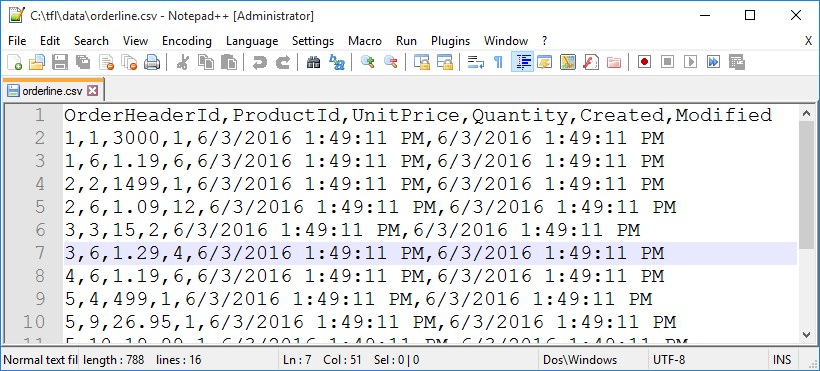
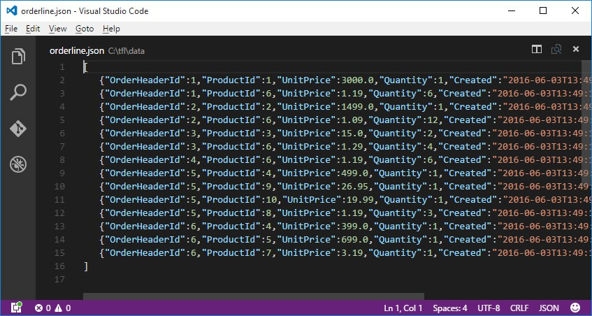

# Example No. 1: Single Entity

Create the file *c:\tfl\business.json* and copy/paste this JSON into it:

```json
{
    "name": "business",
    "connections": [
        {
            "name": "input",
            "provider": "sqlite",
            "file": "c:\\tfl\\data\\business.sqlite3"
        }
    ],
    "entities": [
        {
            "name": "OrderLine"
        }
    ]
}
```

This is a "business" arrangement.  The input connection points to 
our *business.sqlite3* database.  I've added the `OrderLine` entity. 
This is enough to get started.  Save *c:\tfl\business.json*, and at the command 
prompt, run:

```bash
tfl -ac:\tfl\business.json
```  

The `-a` switch refers to an *arrangement*, which in our 
case is the configuration in *c:\tfl\business.json*.

By default, `tfl` logs to the console. Logging is 
implemented with [NLog](http://nlog-project.org/), and is controlled by *nlog.config*. 
There should be a purple warning-level message stating:

> The entity OrderLine doesn't have any input fields defined.

TFL checks (validates) the arrangment. It reports errors 
and warnings in the log. If errors are found, the process is aborted.  If warnings 
are found, the process continues.  

Later in the log, an info-level message states:  

> Detected 6 fields in OrderLine.

TFL detected the fields in `OrderLine`, queried it, and 
output the results to the console:

```bash
OrderHeaderId,ProductId,UnitPrice,Quantity,Created,Modified
1,1,3000,1,6/3/2016 1:49:11 PM,6/3/2016 1:49:11 PM
1,6,1.19,6,6/3/2016 1:49:11 PM,6/3/2016 1:49:11 PM
2,2,1499,1,6/3/2016 1:49:11 PM,6/3/2016 1:49:11 PM
...
```

The default output is [CSV](https://en.wikipedia.org/wiki/Comma-separated_values).  It is mixed in 
with the console logging.  If you wanted just the data, 
you could turn off console logging with the `-l` switch; like this:

```bash
tfl -ac:\tfl\business.json -lnone
```

The command line allows us to pipe the output to 
file and open it as well, like this:

```bash
tfl -ac:\tfl\business.json -lnone > c:\tfl\data\orderline.csv && start c:\tfl\data\orderline.csv
```



**Note**: The *orderline.csv* file should open in the program you 
have associated with .csv files.  This could be Excel, but 
in my case, it's [NotePad++](https://notepad-plus-plus.org).

If you wanted to change the output from CSV to JSON, use the `-o` switch; like this:

```bash
tfl -ac:\tfl\business.json -lnone -ojson > c:\tfl\data\orderline.json && start c:\tfl\data\orderline.json
``` 



**Note**: The *orderline.json* file should open in whatever 
editor you have associated with .json files.  In my case, it's 
[Visual Studio Code](https://code.visualstudio.com).

---

Given a connection, and the entity's name, TFL is **e**xtracting 
the data and **l**oading it to the console.  That's two parts of ETL. We 
need to add a **t**ransformation.  To add transformations, we need to 
defined the fields.

We can leverage's TFL ability to automatically detect the fields by running it 
in check mode.  Check mode does not run the ETL.  Instead, it processes 
the arrangement and returns it.  Switch to check mode by using the `-m` switch:

```bash
tfl -ac:\tfl\business.json -lnone -mcheck > c:\tfl\check.json && start c:\tfl\check.json
```

This should output the arrangement with an array of fields.  You may cut\paste them into 
your *c:\tfl\business.json* arrangement's entity; like this:

```js
// snipped for brevity
{
    "name": "OrderLine",
    "fields": [
        { "name":"OrderHeaderId", "type":"int64", "primarykey":true },
        { "name":"ProductId", "type":"int64", "primarykey":true },
        { "name":"UnitPrice", "type":"decimal" },
        { "name":"Quantity", "type":"int64" },
        { "name":"Created", "type":"datetime" },
        { "name":"Modified", "type":"datetime" }
    ]
}
// snip
```

Now we may add a calculated field like this:

```js
// snip
{
    "name": "OrderLine",
    "fields": [
        { "name":"OrderHeaderId", "type":"int64", "primarykey":true },
        { "name":"ProductId", "type":"int64", "primarykey":true },
        { "name":"UnitPrice", "type":"decimal" },
        { "name":"Quantity", "type":"int64" },
        { "name":"Created", "type":"datetime" },
        { "name":"Modified", "type":"datetime" }
    ],
    "calculated-fields": [
        { "name":"ExtendedPrice", "type":"decimal", "t":"copy(UnitPrice,Quantity).multiply()" }
    ]
}
// snip
```

Above, I added a decimal named "ExtendedPrice" with a transform defined as:

```js
copy(UnitPrice,Quantity).multiply()
```

The `copy` method specifies which fields are input into the `multiply` function. 
The syntax in the `t` property is not a programming language, but instead, is a short-hand 
for this more verbose configuration:

```js
    // snip
    "calculated-fields": [
        { 
            "name":"ExtendedPrice", 
            "type":"decimal",
            "transforms":[
                { 
                    "method":"multiply",
                    "parameters": [
                        { "field":"UnitPrice"},
                        { "field":"Quantity"}
                    ]
                }
            ]
        }
    ]
    // snip
```

This is the style of TFL transformations, where the input is specified up-front in the form 
of a short-hand `copy` function, followed by methods that perform the transformation.

Of course, there is more than one way to accomplish this transform:

```js
copy(UnitPrice,Quantity).js(UnitPrice*Quantity)
```

```js
copy(UnitPrice,Quantity).cs(UnitPrice*Quantity)
```

```js
copy(UnitPrice,Quantity).razor({ var x = UnitPrice * Quantity; }@x)
```

`js` is for JavaScript, `cs` is for C#, and razor is a c# templating language.  With these, you 
can code up just about any transformation.  

TFL's built-in transforms include:

---

- add (sum)
- any
- concat 
- connection 
- contains
- convert
- cs (csharp)
- datediff 
- datepart 
- decompress
- fileext 
- filename 
- filepath 
- format 
- formatphone 
- hashcode 
- htmldecode 
- insert
- is 
- js (javascript)
- join
- last 
- left 
- lower (tolower)
- map 
- multiply 
- next 
- now 
- padleft 
- padright 
- razor 
- regexreplace 
- remove 
- replace 
- right 
- splitlength 
- substring 
- timeago
- timeahead 
- timezone
- tostring 
- totime 
- toyesno 
- trim 
- trimend 
- trimstart 
- upper (toupper)
- xmldecode
- xpath 

