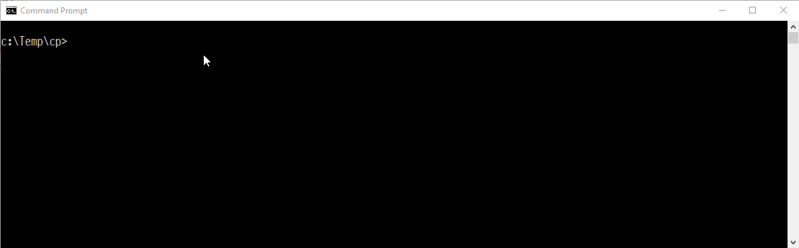

# Transformalize Northwind

Transformalize is an [open source](https://github.com/dalenewman/Transformalize) 
extract, transform, and load ([ETL](https://en.wikipedia.org/wiki/Extract,_transform,_load)) tool. 
It expedites mundane data processing tasks like cleaning, reporting, 
and [denormalization](https://en.wikipedia.org/wiki/Denormalization).

It works with many data sources:

<table class="table table-condensed">
    <thead>
        <tr>
            <th>Provider</th>
            <th>Input</th>
            <th>Output</th>
        </tr>
    </thead>
    <tbody>
        <tr>
            <td>SQL Server</td>
            <td>&#10004;</td>
            <td>&#10004;</td>
        </tr>
        <tr>
            <td>MySql</td>
            <td>&#10004;</td>
            <td>&#10004;</td>
        </tr>
        <tr>
            <td>PostgreSql</td>
            <td>&#10004;</td>
            <td>&#10004;</td>
        </tr>
        <tr>
            <td>SQLite</td>
            <td>&#10004;</td>
            <td>&#10004;</td>
        </tr>
        <tr>
            <td>SqlCe</td>
            <td>&#10004;</td>
            <td>&#10004;</td>
        </tr>
        <tr>
            <td>Elasticsearch</td>
            <td>&#10003;</td>
            <td>&#10003;</td>
        </tr>
        <tr>
            <td>Files</td>
            <td>&#10003;</td>
            <td>&#10003;</td>
        </tr>
        <tr>
            <td>Web</td>
            <td>&#10003;</td>
            <td> </td>
        </tr>
        <tr>
            <td>SOLR</td>
            <td>&#10003;</td>
            <td></td>
        </tr>
        <tr>
            <td>Lucene</td>
            <td>&#10003;</td>
            <td>&#10003;</td>
        </tr>
        <tr>
            <td>Console</td>
            <td></td>
            <td>&#10003;</td>
        </tr>
    </tbody>
</table>

Jobs are arranged in [XML](https://en.wikipedia.org/wiki/XML)
or [JSON](https://en.wikipedia.org/wiki/JSON) and executed 
with a [CLI](https://en.wikipedia.org/wiki/Command-line_interface) or 
in the included [Orchard CMS](http://www.orchardproject.net/) module.

---

This document demonstrates the transformation (and denormalization) 
of Northwind's relational tables into a star-schema or single flat table. 
The de-normalized output may be used:

* As an OLAP cube data source
* To feed an Elasticsearch, SOLR, or Lucene search engine.
* To allow for easier and faster SQL queries.

If you want to follow along, you'll have to:

* have something to edit XML with (e.g. [Visual Studio Code](https://code.visualstudio.com/), or [Notepad++](https://notepad-plus-plus.org/)) 
* have a local instance of SQL Server
* have something to browse a SQLite database file with (e.g. [DB Browser for SQLite](http://sqlitebrowser.org))
* have the latest release of Tranformalize (on [GitHub](https://github.com/dalenewman/Transformalize/releases))
* download and install the [NorthWind](http://www.microsoft.com/en-us/download/details.aspx?id=23654) database

### Getting Started

First, we should take a glance at the Northwind schema (partial).

### The NorthWind Schema


It shows eight tables; the most important [fact table](https://en.wikipedia.org/wiki/Fact_table) 
is *Order Details*.  Start by writing an arrangment (aka configuration) that 
defines the *input* as Northwind's `Order Details` table:

```xml
<cfg name="NorthWind">
  <connections>
    <add name="input" provider="sqlserver" database="NorthWind" />
  </connections>
  <entities>
    <add name="Order Details" />
  </entities>
</cfg>
```

Running `tfl` at this point reads the `Order Details` from 
the table (input) and writes it to the console (output):

<pre>
<strong>> tfl -a NorthWind.xml</strong>
OrderID,ProductID,UnitPrice,Quantity,Discount
10248,11,14.0000,12,0
10248,42,9.8000,10,0
10248,72,34.8000,5,0
10249,14,18.6000,9,0
10249,51,42.4000,40,0
...
</pre>


**Note**: `tfl` detected the schema.  This is handy, but 
if you ever want to apply transformations, or calculate 
new fields, you must define the fields.  You could 
hand-write them, or run `tfl` in `check` mode like this:

<pre><code>
> tfl -a NorthWind.xml <strong>-m check</strong>
...
&lt;fields&gt;
  &lt;add name="OrderID" type="int" primarykey="true" /&gt;
  &lt;add name="ProductID" type="int" primarykey="true" /&gt;
  &lt;add name="UnitPrice" type="decimal" precision="19" scale="4" /&gt;
  &lt;add name="Quantity" type="short" /&gt;
  &lt;add name="Discount" type="single" /&gt;
&lt;/fields>
...
</code></pre>

Instead of getting order details (the records), you get the schema. 
Add the fields section to your arrangement like this:

```xml
<cfg name="NorthWind">
  <connections>
    <add name="input" provider="sqlserver" database="NorthWind"/>
  </connections>
  <entities>
    <add name="Order Details">
      <!-- fields are added here -->
      <fields>
        <add name="OrderID" type="int" primarykey="true" />
        <add name="ProductID" type="int" primarykey="true" />
        <add name="UnitPrice" type="decimal" precision="19" scale="4" />
        <add name="Quantity" type="short" />
        <add name="Discount" type="single" />
      </fields>
    </add>
  </entities>
</cfg>
```

To add a calculated field, add this under the `<fields/>` section:

```xml
<calculated-fields>
  <add name="ExtendedPrice" 
       type="decimal" 
       precision="19" 
       scale="4" 
       t="copy(UnitPrice,Quantity).cs(UnitPrice * Quantity)" />
</calculated-fields>
```

Running `tfl` now produces the same data as before plus the new calculated field 
`ExtendedPrice`:

<pre>
<strong>> tfl -a NorthWind.xml</strong>
OrderID,ProductID,UnitPrice,Quantity,Discount,<strong>ExtendedPrice</strong>
10248,11,14.0000,12,0,<strong>168.0000</strong>
10248,42,9.8000,10,0,<strong>98.0000</strong>
10248,72,34.8000,5,0,<strong>174.0000</strong>
10249,14,18.6000,9,0,<strong>167.4000</strong>
10249,51,42.4000,40,0,<strong>1696.0000</strong>
...
</pre>

The calculuated field added introduced the `t` property which is 
short for *transformation*.  The transformation ran a bit 
of C# (cs) code to multiply `UnitPrice` and `Quantity`.  There 
are many built in transformations to select from (to be covered later).

### Denormalization

The above works with one entity.  However, it is rare that you will 
find all the data you need in one entity.  So, we have 
join (de-normalize) multiple entities together.  In order to do this, 
`tfl` nees a relational output.  So, let's add this to the 
`<connections/>` section:

```xml
<add name="output" provider="sqlite" file="c:\temp\NorthWind.sqlite3" />
```

This is a SQLite output.  Now we are ready to read *Order Details* 
from a SQL Server database, and write them to a SQLite database.  
Whenever you do this for the first time, you must run `tfl` 
in `init` mode:

<pre>
> tfl -a NorthWind.xml <strong>-m init</strong>
2017-06-12 17:27:19 | info  | NorthWind |               | Compiled NorthWind user code in 00:00:00.1044231.
2016-12-12 15:59:46 | warn  | NorthWind | Order Details | Initializing
2016-12-12 15:59:46 | info  | NorthWind | Order Details | Starting
2016-12-12 15:59:47 | info  | NorthWind | Order Details | 2155 from input
2016-12-12 15:59:47 | info  | NorthWind | Order Details | 2155 inserts into output Order Details
2016-12-12 15:59:47 | info  | NorthWind | Order Details | Ending 00:00:00.1715532
</pre>

Init mode prepares the output, and bulk inserts data into it.  Now, 
run `tfl` without specifying a mode:

<pre>
<strong>> tfl -a NorthWind.xml</strong>
2016-12-12 16:04:03 | info  | NorthWind | Order Details | Starting
2016-12-12 16:04:03 | info  | NorthWind | Order Details | 2155 from input
2016-12-12 16:04:03 | info  | NorthWind | Order Details | Ending 00:00:00.5467704
</pre>



By default, **`tfl`** reads input and updates output **only** *if necessary*.  
To determine if an update is necessary, `tfl` reads *all* the input 
and compares it with the output.  This is inefficient.

A better approach is to only read new or updated records from the 
input.  This is possible if each row has a field that increments 
every time a record is inserted or updated.  Conveniently 
enough, SQL Server offers a `ROWVERSION` type for this.

Add a `RowVersion` column to `Order Details` like this:

```sql
ALTER TABLE [Order Details] ADD [RowVersion] ROWVERSION;
```

Update the *Order Details* entity to use RowVersion:

```xml
<entities>
                            <!----- here ------>
  <add name="Order Details" version="RowVersion" >
    <fields>
      <add name="OrderID" type="int" primary-key="true" />
      <add name="ProductID" type="int" primary-key="true" />
      <add name="Discount" type="single" />
      <add name="Quantity" type="short" />
      <add name="UnitPrice" type="decimal" precision="19" scale="4"/>

      <!------------------ and here ------------------->
      <add name="RowVersion" type="byte[]" length="8" />
    </fields>
  </add>
</entities> 
```

When adding a field to an entity, the output 
must be re-initialized.  So, please re-initialize:

<pre>
<strong>tfl -a NorthWind.xml -m init</strong>
2016-12-12 16:59:27 | warn  | NorthWind | Order Details | Initializing
2016-12-12 16:59:27 | info  | NorthWind | Order Details | Starting
2016-12-12 16:59:27 | info  | NorthWind | Order Details | <strong>Change Detected: Input: 0x6032C != Output: null</strong>
2016-12-12 16:59:27 | info  | NorthWind | Order Details | 2155 from input
2016-12-12 16:59:27 | info  | NorthWind | Order Details | 2155 inserts into output Order Details
2016-12-12 16:59:27 | info  | NorthWind | Order Details | Ending 00:00:00.1553228
</pre>

Now, to test how many rows are read, run `tfl` in default mode:

<pre>
<strong>tfl -a NorthWind.xml</strong>
2016-12-12 16:59:40 | info  | NorthWind | Order Details | Starting
2016-12-12 16:59:40 | info  | NorthWind | Order Details | <strong>Change Detected: No.</strong>
2016-12-12 16:59:40 | info  | NorthWind | Order Details | Ending 00:00:00.1248674
</pre>

**Note**: the second run doesn't say *2155 from input* anymore, 
instead it says *Change Detected: No*.  **`tfl`** didn't have 
to load the records. Using the row version, it was able 
to determine the data had not changed.

**Output**

Just to make sure things are working, using your SQLite tool, 
query the output for data:

```sql
SELECT	Discount,
	OrderID,
	ProductID,
	Quantity,
	UnitPrice
FROM NorthWindStar
LIMIT 10;
```

<pre>
<strong>Discount   OrderID     ProductID   Quantity UnitPrice</strong>
---------- ----------- ----------- -------- ---------
0.2        10248       11          12       14.0000
0          10248       42          10       9.8000
0          10248       72          5        34.8000
0          10249       14          9        18.6000
0          10249       51          40       42.4000
0          10250       41          10       7.7000
0.15       10250       51          35       42.4000
0.15       10250       65          15       16.8000
0.05       10251       22          6        16.8000
0.05       10251       57          15       15.6000
</pre>

---

Review the NorthWind diagram. The next closest tables to 
*Order Details* are *Orders* and *Products*.  Alter these 
tables to include the `RowVersion` column, and then add 
the *Orders* entity. 

**Hint**: Comment out *Order Details*, add entity &lt;add name=&quot;Orders&quot;/&gt; 
and run Tfl in check mode.

```xml
<add name="Orders" version="RowVersion">
  <fields>
    <add name="OrderID" type="int" primary-key="true" />
    <add name="CustomerID" length="5" />
    <add name="EmployeeID" type="int" />
    <add name="OrderDate" type="datetime" />
    <add name="RequiredDate" type="datetime" />
    <add name="ShippedDate" type="datetime" />
    <add name="ShipVia" type="int" />
    <add name="Freight" type="decimal" precision="19" scale="4" />
    <add name="ShipName" length="40" />
    <add name="ShipAddress" length="60" />
    <add name="ShipCity" length="15" />
    <add name="ShipRegion" length="15" />
    <add name="ShipPostalCode" length="10" />
    <add name="ShipCountry" length="15" />
    <add name="RowVersion" type="byte[]" length="8" />
  </fields>
</add> 
```

Since we added another table, we have to re-initialize:

<pre>
<strong>tfl -a NorthWind.xml -m init</strong>
2017-05-18 16:13:55 | error | Process | The entity field 'rowversion' occurs more than once. Remove, alias, or prefix one.
2017-05-18 16:13:55 | error | Process | You have 2 entities so you need 1 relationships. You have 0 relationships.
2017-05-18 16:13:55 | error | Process | The configuration errors must be fixed before this job will run.
</pre>

Bad news.  The configuration is invalid.  **`tfl`** reports 
errors instead of running.


**Error: Unique Names Required**

The first error says we can't have 
two fields with the same name.  When we de-normalize data, 
we need to give each field a unique name.

```xml
    <add name="RowVersion" type="byte[]" length="8" />
```

needs to be updated to:

```xml
    <!-- add new name in alias attribute -->
    <add name="RowVersion" type="byte[]" length="8" alias="OrdersVersion" />
```

**Error: Relationships Required**

The second error says we need to relate *Order Details* with *Orders*.  When another 
table is added, it must be related to the master table. 
The master table is the first table defined. In this case, 
it is `Order Details`. So, we have to add a relationship 
to `Orders` like this:

```xml
  <connections/>
  <entities/>
  <relationships>
    <add left-entity="Order Details" left-field="OrderID" right-entity="Orders" right-field="OrderID"/>
  </relationships>
```

Re-initialize and run.

<pre>
<strong>tfl -a NorthWind.xml -m init</strong>
2017-05-18 16:42:44 | info  | NorthWind | Order Details | Starting
2017-05-18 16:42:44 | info  | NorthWind | Order Details | Change Detected: Input: 0x71c5a > Output: null
2017-05-18 16:42:44 | info  | NorthWind | Order Details | 2155 from input
2017-05-18 16:42:44 | info  | NorthWind | Order Details | 2155 inserts into output
2017-05-18 16:42:44 | info  | NorthWind | Orders        | Starting
2017-05-18 16:42:44 | info  | NorthWind | Orders        | Change Detected: Input: 0x71c5b > Output: null
2017-05-18 16:42:44 | info  | NorthWind | Orders        | <strong>830 from input</strong>
2017-05-18 16:42:44 | info  | NorthWind | Orders        | <strong>830 inserts into output</strong>
2017-05-18 16:42:44 | info  | NorthWind |               | Time elapsed: 00:00:01.2331675
<strong>tfl -a NorthWind.xml</strong>
2017-05-18 16:43:36 | info  | NorthWind | Order Details | Starting
2017-05-18 16:43:36 | info  | NorthWind | Order Details | Change Detected: No.
2017-05-18 16:43:36 | info  | NorthWind | Orders        | Starting
2017-05-18 16:43:36 | info  | NorthWind | Orders        | Change Detected: No.
2017-05-18 16:43:36 | info  | NorthWind |               | Time elapsed: 00:00:00.3415624
</pre>

Notice the logging indicates 830 records were processed from the `Orders` table.  
In addition to copying the data from `Order Details` and `Orders` to 
the output, `tfl` created a view called `NorthWindStar`.  Take a 
look to make sure it's working:

```sql
SELECT
	Discount AS Disc,
	OrderID,
	ProductID AS PId,
	Quantity AS Qty,
	UnitPrice,
	CustomerID AS CustId,
	EmployeeID AS EId,
	Freight,
	OrderDate,
	RequiredDate,
	ShipAddress,
	ShipCity,
	ShippedDate,
	ShipPostalCode,
	ShipRegion,
	ShipVia AS SId
FROM NorthWindStar
LIMIT 10;
```

<pre>
<strong>Disc OrderID PId Qty UnitPrice  CustId EId Freight  OrderDate  RequiredDate ShipAddress            ShipCity        ShippedDate ShipPostalCode ShipRegion Sid
---- ------- --- --- ---------  ------ --- -------- ---------- ------------ ---------------------- --------------- ----------- -------------- ---------- ---</strong>
0.2  10248   11  12  14.0000    VINET  5   32.3800  1996-07-04 1996-08-01   59 rue de l&#39;Abbaye     Reims           1996-07-16  51100                     3
0    10248   42  10  9.8000     VINET  5   32.3800  1996-07-04 1996-08-01   59 rue de l&#39;Abbaye     Reims           1996-07-16  51100                     3
0    10248   72  5   34.8000    VINET  5   32.3800  1996-07-04 1996-08-01   59 rue de l&#39;Abbaye     Reims           1996-07-16  51100                     3
0    10249   14  9   18.6000    TOMSP  6   11.6100  1996-07-05 1996-08-16   Luisenstr. 48          M&uuml;nster         1996-07-10  44087                     1
0    10249   51  40  42.4000    TOMSP  6   11.6100  1996-07-05 1996-08-16   Luisenstr. 48          M&uuml;nster         1996-07-10  44087                     1
0    10250   41  10  7.7000     HANAR  4   65.8300  1996-07-08 1996-08-05   Rua do Pa&ccedil;o, 67        Rio de Janeiro  1996-07-12  05454-876      RJ         2
0.15 10250   51  35  42.4000    HANAR  4   65.8300  1996-07-08 1996-08-05   Rua do Pa&ccedil;o, 67        Rio de Janeiro  1996-07-12  05454-876      RJ         2
0.15 10250   65  15  16.8000    HANAR  4   65.8300  1996-07-08 1996-08-05   Rua do Pa&ccedil;o, 67        Rio de Janeiro  1996-07-12  05454-876      RJ         2
0.05 10251   22  6   16.8000    VICTE  3   41.3400  1996-07-08 1996-08-05   2, rue du Commerce     Lyon            1996-07-15  69004                     1
0.05 10251   57  15  15.6000    VICTE  3   41.3400  1996-07-08 1996-08-05   2, rue du Commerce     Lyon            1996-07-15  69004                     1
</pre>

Now, rinse and repeat. That is, consult the NorthWind diagram and continue adding related entities until the relationships configuration look like this:

```xml
<relationships>
    <add left-entity="Order Details" left-field="OrderID" right-entity="Orders" right-field="OrderID" />
    <add left-entity="Order Details" left-field="ProductID" right-entity="Products" right-field="ProductID" />
    <add left-entity="Orders" left-field="CustomerID" right-entity="Customers" right-field="CustomerID" />
    <add left-entity="Orders" left-field="EmployeeID" right-entity="Employees" right-field="EmployeeID" />
    <add left-entity="Orders" left-field="ShipVia" right-entity="Shippers" right-field="ShipperID" />
    <add left-entity="Products" left-field="SupplierID" right-entity="Suppliers" right-field="SupplierID" />
    <add left-entity="Products" left-field="CategoryID" right-entity="Categories" right-field="CategoryID" />
</relationships>

```

As you might expect, adding all these entities creates many 
duplicate field names. Instead of aliasing each one, 
we can add a prefix to the entity. A prefix aliases all the 
fields as prefix + name.

```xml
<!-- set prefix attribute to "Employee" --> 
<add name="Employees" version="RowVersion" prefix="Employee">
  <fields>
    <!-- cut for brevity -->
  </fields>
</add>
```

Initialize, and run. Console output should look like this:

<pre class="prettyprint linenums">
tfl NorthWind.xml {&#39;mode&#39;:&#39;init&#39;}
19:41:53 | Info | NorthWind | All | Initialized TrAnSfOrMaLiZeR.
19:41:53 | Info | NorthWind | All | Initialized NorthWindOrderDetails in NorthWindOutput on localhost.
19:41:53 | Info | NorthWind | All | Initialized NorthWindOrders in NorthWindOutput on localhost.
19:41:53 | Info | NorthWind | All | Initialized NorthWindProducts in NorthWindOutput on localhost.
19:41:53 | Info | NorthWind | All | Initialized NorthWindCustomers in NorthWindOutput on localhost.
19:41:53 | Info | NorthWind | All | Initialized NorthWindEmployees in NorthWindOutput on localhost.
19:41:53 | Info | NorthWind | All | Initialized NorthWindShippers in NorthWindOutput on localhost.
19:41:53 | Info | NorthWind | All | Initialized NorthWindSuppliers in NorthWindOutput on localhost.
19:41:53 | Info | NorthWind | All | Initialized NorthWindCategories in NorthWindOutput on localhost.
19:41:53 | Info | NorthWind | All | Process completed in 00:00:01.1828232.
tfl NorthWind.xml
19:42:06 | Info | NorthWind | Order Details....... | Processed 2155 inserts, and 0 updates in Order Details.
19:42:07 | Info | NorthWind | Orders.............. | Processed 830 inserts, and 0 updates in Orders.
19:42:07 | Info | NorthWind | Products............ | Processed 77 inserts, and 0 updates in Products.
19:42:07 | Info | NorthWind | Customers........... | Processed 91 inserts, and 0 updates in Customers.
19:42:07 | Info | NorthWind | Employees........... | Processed 9 inserts, and 0 updates in Employees.
19:42:07 | Info | NorthWind | Shippers............ | Processed 3 inserts, and 0 updates in Shippers.
19:42:07 | Info | NorthWind | Suppliers........... | Processed 29 inserts, and 0 updates in Suppliers.
19:42:07 | Info | NorthWind | Categories.......... | Processed 8 inserts, and 0 updates in Categories.
19:42:07 | Info | NorthWind | Orders.............. | Processed 2155 rows. Updated Order Details with Orders.
19:42:07 | Info | NorthWind | Products............ | Processed 2155 rows. Updated Order Details with Products.
19:42:07 | Info | NorthWind | All................. | Process completed in 00:00:01.2583563.
tfl NorthWind.xml
19:42:13 | Info | NorthWind | Order Details....... | Processed 0 inserts, and 0 updates in Order Details.
19:42:13 | Info | NorthWind | Orders.............. | Processed 0 inserts, and 0 updates in Orders.
19:42:13 | Info | NorthWind | Products............ | Processed 0 inserts, and 0 updates in Products.
19:42:13 | Info | NorthWind | Customers........... | Processed 0 inserts, and 0 updates in Customers.
19:42:13 | Info | NorthWind | Employees........... | Processed 0 inserts, and 0 updates in Employees.
19:42:13 | Info | NorthWind | Shippers............ | Processed 0 inserts, and 0 updates in Shippers.
19:42:13 | Info | NorthWind | Suppliers........... | Processed 0 inserts, and 0 updates in Suppliers.
19:42:13 | Info | NorthWind | Categories.......... | Processed 0 inserts, and 0 updates in Categories.
19:42:13 | Info | NorthWind | All................. | Process completed in 00:00:00.7708553.
</pre>

Now there are 81 fields available in the output `NorthWindStar`:

<pre class="prettyprint linenums lang-sql">
SELECT COUNT(*) AS FieldCount
FROM INFORMATION_SCHEMA.COLUMNS
WHERE TABLE_NAME = &#39;NorthWindStar&#39;
</pre>
<pre class="prettyprint linenums">
FieldCount
----------
81
</pre>


As you can see in the diagram above, I haven&#39;t completely de-normalized the data. &nbsp;Instead, I have created a [star schema](http://en.wikipedia.org/wiki/Star_schema), where every related table has a single join to the master table. &nbsp;In addition, I have created a view (e.g. NorthWind**Star**) so users may query it as if it we&#39;re a single table.&nbsp; Having this single view of the duplicated data allows us to quickly create simple cubes or integrate with search engines:&nbsp;

#### Leveraging SQL Server Analysis Services

Open up [BIDS](http://technet.microsoft.com/en-us/library/ms173767%28v=sql.105%29.aspx), and create an Analysis Services Project (or cube) to browse the data.

* Set the data source to your NorthWindOutput database&nbsp;
* Set the data view to the NorthWindStar view
* Create a dimension using all the fields (except the binary ones) in the view. Call it Properties.
* Create a cube with a couple measures (e.g. UnitPrice, Quantity) and connect it to the Properties dimension.
* Process the cube and browse it. Note: You may have to grant NT AUTHORITY\LOCAL SERVICE read writes to the NorthWindOutput database.


As you can see, slicing the measures by order date isn&#39;t ideal. Moreover, the unit price and quantity measures don&#39;t help much by themselves. This cube needs a time hierarchy and revenue calculation. We can add them with Transformalize. First, add three calculated fields based on &quot;order date&quot; to create a time hierarchy:

<pre class="prettyprint linenums">
&lt;add name=&quot;Orders&quot; version=&quot;RowVersion&quot; prefix=&quot;Orders&quot;&gt;
    &lt;fields&gt;
      &lt;!-- ... --&gt;
    &lt;/fields&gt;
    &lt;calculated-fields&gt;
      &lt;add name=&quot;TimeDate&quot; length=&quot;10&quot; default=&quot;9999-12-31&quot;&gt;
        &lt;transforms&gt;
            &lt;add method=&quot;toString&quot; format=&quot;yyyy-MM-dd&quot; parameter=&quot;OrderDate&quot; /&gt;
        &lt;/transforms&gt;
      &lt;/add&gt;
      &lt;add name=&quot;TimeMonth&quot; length=&quot;6&quot; default=&quot;12-DEC&quot;&gt;
        &lt;transforms&gt;
            &lt;add method=&quot;toString&quot; format=&quot;MM-MMM&quot; parameter=&quot;OrderDate&quot; /&gt;
            &lt;add method=&quot;toUpper&quot; /&gt;
        &lt;/transforms&gt;
      &lt;/add&gt;
      &lt;add name=&quot;TimeYear&quot; type=&quot;System.Int16&quot; default=&quot;9999&quot;&gt;
        &lt;transforms&gt;
            &lt;add method=&quot;toString&quot; format=&quot;yyyy&quot; parameter=&quot;OrderDate&quot; /&gt;
		&lt;/transforms&gt;
      &lt;/add&gt;
    &lt;/calculated-fields&gt;
&lt;/add&gt;
</pre>

Calculated fields project new fields based on the values of other fields and previously defined other calculated fields. They are used at the entity level, or at the process level. In an entity, they have access to any field within their entity. In a process, they have access to all of the data. To control which fields they have access to, use parameters like this:

<pre class="prettyprint linenums">
&lt;transform method=&quot;format&quot; format=&quot;{0} is a big city!&quot;&gt;
    &lt;parameters&gt;
        &lt;add field=&quot;City&quot; /&gt;
    &lt;/parameters&gt;
&lt;/transform&gt;
</pre>

You may add multiple parameters in this way. &nbsp;However, if you only have a single parameter, you can specify it in the parameter attribute in the transform element itself, like this:

<pre class="prettyprint linenums">
&lt;transform method=&quot;format&quot; format=&quot;{0} is a big city!&quot; parameter=&quot;City&quot; /&gt;&nbsp;
</pre>

Another short-cut is to set the parameter attribute to &quot;*&quot; to include all fields.

There are many built-in [Transforms](https://github.com/dalenewman/Transformalize/wiki/Transforms).  If you can&#39;t find one that fits your needs, you can use the C#, JavaScript, or the Razor template transforms to define your own. Let&#39;s use a JavaScript transform to calculate revenue:

<pre class="prettyprint linenums">
&lt;calculated-fields&gt;
    &lt;add name=&quot;Revenue&quot; type=&quot;System.Decimal&quot; &gt;
        &lt;transforms&gt;
            &lt;add method=&quot;javascript&quot; script=&quot;(UnitPrice * (1 - Discount)) * Quantity&quot; parameter=&quot;*&quot; /&gt;
        &lt;/transforms&gt;
    &lt;/add&gt;
&lt;/calculated-fields&gt;
</pre>

Re-initialize and run Tfl. Then, using the new time fields and revenue, see if it improves the cube browsing experience.


The cube looks better now, but we&#39;ll need it to update whenever Transformalize runs. &nbsp;So, &nbsp;add a connection to Analysis Services and a corresponding template action:&nbsp;

<pre class="prettyprint linenums">
&lt;connections&gt;
    &lt;add name=&quot;input&quot; connection-string=&quot;server=localhost;Database=NorthWind;Trusted_Connection=True;&quot;/&gt;
    &lt;add name=&quot;output&quot; connection-string=&quot;Server=localhost;Database=NorthWindOutput;Trusted_Connection=True;&quot;/&gt;
    &lt;add name=&quot;cube&quot; connection-string=&quot;Data Source=localhost;Catalog=NorthWind;&quot; provider=&quot;AnalysisServices&quot;/&gt;
&lt;/connections&gt;
&lt;!-- ... --&gt;
&lt;templates path=&quot;C:\Tfl\&quot;&gt;
    &lt;add name=&quot;process-cube&quot; file=&quot;process-cube.xmla&quot;&gt;
        &lt;settings&gt;
            &lt;add name=&quot;DatabaseID&quot; value=&quot;NorthWind2&quot;&gt;&lt;/add&gt;
        &lt;/settings&gt;    
        &lt;actions&gt;
            &lt;add action=&quot;run&quot; connection=&quot;cube&quot;&gt;&lt;/add&gt;
        &lt;/actions&gt;
    &lt;/add&gt;
&lt;/templates&gt;**
</pre>

Transformalize &quot;templates&quot; use [C# Razor syntax](http://haacked.com/archive/2011/01/06/razor-syntax-quick-reference.aspx). Settings are passed into the template and used like this:

<pre class="prettyprint linenums">
&lt;Batch xmlns=&quot;http://schemas.microsoft.com/analysisservices/2003/engine&quot;&gt;
  &lt;Process xmlns:xsd=&quot;http://www.w3.org/2001/XMLSchema&quot; xmlns:xsi=&quot;http://www.w3.org/2001/XMLSchema-instance&quot; xmlns:ddl2=&quot;http://schemas.microsoft.com/analysisservices/2003/engine/2&quot; xmlns:ddl2_2=&quot;http://schemas.microsoft.com/analysisservices/2003/engine/2/2&quot; xmlns:ddl100_100=&quot;http://schemas.microsoft.com/analysisservices/2008/engine/100/100&quot; xmlns:ddl200=&quot;http://schemas.microsoft.com/analysisservices/2010/engine/200&quot; xmlns:ddl200_200=&quot;http://schemas.microsoft.com/analysisservices/2010/engine/200/200&quot;&gt;
    &lt;Object&gt;
      &lt;DatabaseID&gt;@(Model.Settings.DatabaseID)&lt;/DatabaseID&gt;
    &lt;/Object&gt;
    &lt;Type&gt;ProcessFull&lt;/Type&gt;
    &lt;WriteBackTableCreation&gt;UseExisting&lt;/WriteBackTableCreation&gt;
  &lt;/Process&gt;
&lt;/Batch&gt;
</pre>

The `@(Model.Settings.DatabaseID)` will be replaced with `NorthWind2`.  Transformalize&#39;s template manager will render the template, and subsequently run defined &quot;actions.&quot; The &quot;run&quot; action executes the rendered content against the designated connection. &nbsp;This allows you to dynamically build data manipulation queries, or XMLA commands in this case, and execute them.

<pre class="prettyprint linenums">
tfl NorthWind.xml
00:14:28 | Info | NorthWind | Order Details.. | Processed 2155 inserts, and 0 updates in Order Details.
00:14:28 | Info | NorthWind | Orders......... | Processed 830 inserts, and 0 updates in Orders.
00:14:28 | Info | NorthWind | Products....... | Processed 77 inserts, and 0 updates in Products.
00:14:28 | Info | NorthWind | Customers...... | Processed 91 inserts, and 0 updates in Customers.
00:14:28 | Info | NorthWind | Employees...... | Processed 9 inserts, and 0 updates in Employees.
00:14:28 | Info | NorthWind | Shippers....... | Processed 3 inserts, and 0 updates in Shippers.
00:14:28 | Info | NorthWind | Suppliers...... | Processed 29 inserts, and 0 updates in Suppliers.
00:14:28 | Info | NorthWind | Categories..... | Processed 8 inserts, and 0 updates in Categories.
00:14:28 | Info | NorthWind | Orders......... | Processed 2155 rows. Updated Order Details with Orders.
00:14:29 | Info | NorthWind | Products....... | Processed 2155 rows. Updated Order Details with Products.
00:14:31 | Info | NorthWind | Categories..... | process-cube ran successfully.
00:14:31 | Info | NorthWind | All............ | Process completed in 00:00:03.8312882.
</pre>

#### Leveraging Apache SOLR

With more complex templates, and an Apache [SOLR](http://lucene.apache.org/solr/) server, it is possible to integrate full text search into the process as well. &nbsp;Transformalize comes with a pair of templates that can build the necessary SOLR configuration files for schema, and data import handling.&nbsp;

<pre class="prettyprint linenums">
&lt;templates&gt;
    &lt;add name=&quot;solr-data-handler&quot; file=&quot;solr-data-handler.cshtml&quot; cache=&quot;true&quot;&gt;
      &lt;actions&gt;
        &lt;add action=&quot;copy&quot; file=&quot;C:\Solr\NorthWind\conf\data-config.xml&quot;/&gt;
      &lt;/actions&gt;
    &lt;/add&gt;
    &lt;add name=&quot;solr-schema&quot; file=&quot;solr-schema.cshtml&quot; cache=&quot;true&quot;&gt;
      &lt;actions&gt;
        &lt;add action=&quot;copy&quot; file=&quot;C:\Solr\NorthWind\conf\schema.xml&quot;/&gt;
        &lt;add action=&quot;web&quot; url=&quot;http://localhost:8983/solr/NorthWind/dataimport?command=full-import&amp;amp;clean=true&amp;amp;commit=true&amp;amp;optimize=true&quot;/&gt;
      &lt;/actions&gt;
    &lt;/add&gt;
&lt;/templates&gt;
&lt;search-types&gt;
    &lt;add name=&quot;default&quot; /&gt;
    &lt;add name=&quot;facet&quot; analyzer=&quot;lowercase&quot; store=&quot;true&quot; index=&quot;true&quot; /&gt;
    &lt;add name=&quot;standard&quot; analyzer=&quot;standard_lowercase&quot; store=&quot;false&quot; index=&quot;true&quot;/&gt;
&lt;/search-types&gt;
</pre>

The Razor templates &quot;_solr-data-handler.cshtml_&quot; and &quot;_solr-schema.cshtml_&quot; render the SOLR configuration files. &nbsp;This is possible because the template manager passes the entire NorthWind configuration (that we've built with XML above) into the templates.

To control how the fields are handled in SOLR, &quot;search types&quot; are applied to each `&lt;field/&gt;` or `&lt;calculated-field/&gt;`. By default, each field is indexed and stored in the search index according to it&#39;s data type. To assign more complex text analysis, you can set the search-type attribute to facet, or standard, or any others you define. To exclude a field from search, set search-type to &quot;none.&quot;

Running Tfl now produces:

<pre class="prettyprint">
    tfl NorthWind.xml
    ...
    00:48:25 | Info | NorthWind | Products.... | Processed 2155 rows. Updated Order Details with Products.
    00:48:28 | Info | NorthWind | Categories.. | process-cube ran successfully.
    00:48:28 | Info | NorthWind | Categories.. | Copied solr-data-handler template output to C:\Solr\NorthWind\conf\data-config.xml.
    00:48:29 | Info | NorthWind | Categories.. | Copied solr-schema template output to C:\Solr\NorthWind\conf\schema.xml.
    00:48:29 | Info | NorthWind | Categories.. | Made web request to http://localhost:8983/solr/NorthWind/dataimport?command=full-import&amp;clean=true&amp;commit=true&amp;optimize=true.
    00:48:29 | Info | NorthWind | Categories.. | Process completed in 00:00:04.8287386.
</pre>

In this example, the template action &quot;web&quot; triggers SOLR to clean and re-import the index. In a production environment, you&#39;d want to reload the schema when it changes, and make use of full and delta imports appropriately. If all goes well, you see something like this in the SOLR admin:


Now, if you schedule Transformalize to run every couple minutes, you have near real-time OLAP and search engine services on top of your OLTP data. &nbsp;An OLAP cube supports more performant and complex reporting requirements, and a search engine allows for lightning fast and _fuzzy_&nbsp;searches for specific records. &nbsp;If your users want to see the data in different ways, and they will, all you have to do is add transforms and/or new calculated fields and re-initialize your output. &nbsp;

When Transformalize reads your production databases, it attempts to do so introducing as little contention as possible.  Using version fields, it can keep a star-schema copy of very large databases up to date very quickly.

### Summary

The NorthWind data is fairly clean. In reality, you&#39;ll face more challenging data sources.

---

Transformalize uses several other open source projects including

1. [Rhino ETL](https://github.com/hibernating-rhinos/rhino-etl)
1. [Razor Engine](https://github.com/Antaris/RazorEngine)
1. [Jint](https://github.com/sebastienros/jint)
1. [Ninject](http://www.ninject.org/)
1. [fastJSON](http://www.codeproject.com/Articles/159450/fastJSON)
1. [Newtonsoft.JSON](https://github.com/JamesNK/Newtonsoft.Json)
1. [Dapper-dot-net](https://github.com/SamSaffron/dapper-dot-net)
1. [File Helpers](http://filehelpers.sourceforge.net/)
1. [Excel Data Reader](http://exceldatareader.codeplex.com/)
1. [Enterprise Library 6 Validation & Semantic Logging Blocks](http://msdn.microsoft.com/library/cc467894.aspx "Enterprise Library Home Page")
1. [Lucene.NET](http://lucenenet.apache.org/)
1. [Elasticsearch.NET & NEST](https://github.com/elasticsearch/elasticsearch-net)
1. [SolrNet](https://github.com/mausch/SolrNet)

Where possible, I've included source code from these projects rather than the Nuget packages. The upside &nbsp;of doing this is I get to step into and learn from other people&#39;s code. The downside is it&#39;s a bit harder to keep these libraries up to date.

<script src="http://cdnjs.cloudflare.com/ajax/libs/prettify/r298/run_prettify.js" type="text/javascript"></script>