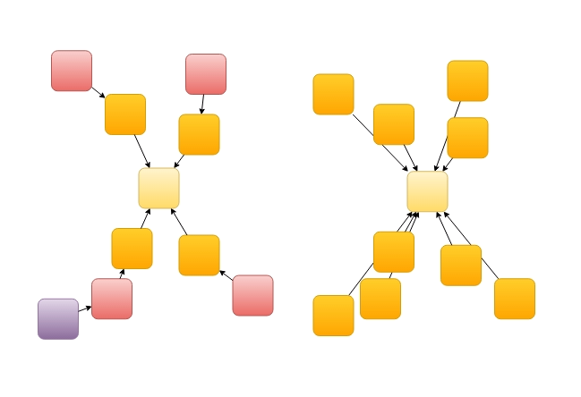

# Transformalize

Transformalize is an open source extract, transform, and load ([ETL](https://en.wikipedia.org/wiki/Extract,_transform,_load)) 
tool. It expedites the process of cleaning, and [de-normalizing](https://en.wikipedia.org/wiki/Denormalization) relational data. It automates the movement of relational data into value-adding services 
like data warehouses (analytics) and search engines.

 It works with many data sources:

<table class="table table-condensed">
    <thead>
        <tr>
            <th>Provider</th>
            <th>Read<br/>Input</th>
            <th>Write<br/>Output</th>
            <th>De-<br/>normalize</th>
        </tr>
    </thead>
    <tbody>
        <tr>
            <td>SQL Server</td>
            <td style="color:green">&#10003;</td>
            <td style="color:green">&#10003;</td>
            <td style="color:green">&#10003;</td>
        </tr>
        <tr>
            <td>MySql</td>
            <td style="color:green">&#10003;</td>
            <td style="color:green">&#10003;</td>
            <td style="color:green">&#10003;</td>
        </tr>
        <tr>
            <td>PostgreSql</td>
            <td style="color:green">&#10003;</td>
            <td style="color:green">&#10003;</td>
            <td style="color:green">&#10003;</td>
        </tr>
        <tr>
            <td>SQLite</td>
            <td style="color:green">&#10003;</td>
            <td style="color:green">&#10003;</td>
            <td style="color:green">&#10003;</td>
        </tr>
        <tr>
            <td>SqlCe</td>
            <td style="color:green">&#10003;</td>
            <td style="color:green">&#10003;</td>
            <td style="color:green">&#10003;</td>
        </tr>
        <tr>
            <td>Elasticsearch</td>
            <td style="color:green">&#10003;</td>
            <td style="color:green">&#10003;</td>
            <td> </td>
        </tr>
        <tr>
            <td>Files</td>
            <td style="color:green;">&#10003;</td>
            <td style="color:green">&#10003;</td>
            <td> </td>
        </tr>
        <tr>
            <td>Web</td>
            <td style="color:green">&#10003;</td>
            <td> </td>
            <td> </td>
        </tr>
        <tr>
            <td>SOLR</td>
            <td style="color:green">&#10003;</td>
            <td> </td>
            <td> </td>
        </tr>
        <tr>
            <td>Lucene</td>
            <td style="color:green">&#10003;</td>
            <td style="color:green">&#10003;</td>
            <td> </td>
        </tr>
        <tr>
            <td>Console</td>
            <td> </td>
            <td style="color:green">&#10003;</td>
            <td> </td>
        </tr>
    </tbody>
</table>

Jobs are arranged in [XML](https://en.wikipedia.org/wiki/XML)
or [JSON](https://en.wikipedia.org/wiki/JSON) and executed 
with a [CLI](https://en.wikipedia.org/wiki/Command-line_interface) or 
an [Orchard CMS](http://www.orchardproject.net/) module.

---

### Transformalizing Northwind

This document demonstrates the transformation (and denormalization) 
of Northwind's relational database tables into a [star-schema](https://en.wikipedia.org/wiki/Star_schema) or single flat table. 

If you want to follow along, here are the prerequisites:

* something to edit XML with (e.g. [Visual Studio Code](https://code.visualstudio.com/), or [Notepad++](https://notepad-plus-plus.org/)) 
* a local instance of SQL Server
* something to browse a SQLite database file with (e.g. [DB Browser for SQLite](http://sqlitebrowser.org))
* the [latest release](https://github.com/dalenewman/Transformalize/releases) of Tranformalize with it's `PATH` added to your [environment variables](https://en.wikipedia.org/wiki/PATH_(variable)).
* the [NorthWind](http://www.microsoft.com/en-us/download/details.aspx?id=23654) database

### Getting Started

The first step is to familiarize yourself with the input's schema.  Take a glance at the Northwind schema below (partial).

#### The NorthWind Schema


The diagram shows eight [normalized](https://en.wikipedia.org/wiki/Database_normalization) 
tables. The most important [fact table](https://en.wikipedia.org/wiki/Fact_table) is 
*Order Details*.  It contains the sales and is related to everything else.

#### The Fact Table - Order Details

Let's start by writing an arrangment (aka configuration) that defines 
the *input* as Northwind's `Order Details` table.  Open your editor and 
paste this in:

```xml
<cfg name="NorthWind">
  <connections>
    <add name="input" 
         provider="sqlserver"
         server="localhost"
         database="NorthWind" />
  </connections>
  <entities>
    <add name="Order Details" />
  </entities>
</cfg>
```

The root element is `<cfg/>` and it requires a `name`.  Within `<cfg/>`, 
I've added `<connections/>` and `<entities/>` sections.  Save the arrangement as 
*NorthWind.xml* and use the **`tfl.exe`** CLI to run it:

<pre style="font-size:smaller;">
<strong>> tfl -a NorthWind.xml</strong>
OrderID,ProductID,UnitPrice,Quantity,Discount
10248,11,14.0000,12,0
10248,42,9.8000,10,0
10248,72,34.8000,5,0
10249,14,18.6000,9,0
10249,51,42.4000,40,0
...
</pre>


Transformalize detected the *Order Details* schema automatically and read the data.  This is handy, 
but if you want to transform existing or create new fields, you must define the fields.  You could 
hand-write them, or run `tfl` in `check` mode like this:

<pre style="font-size:smaller;">
> tfl -a NorthWind.xml <strong>-m check</strong>
...
&lt;fields&gt;
  &lt;add name="OrderID" type="int" primarykey="true" /&gt;
  &lt;add name="ProductID" type="int" primarykey="true" /&gt;
  &lt;add name="UnitPrice" type="decimal" precision="19" scale="4" /&gt;
  &lt;add name="Quantity" type="short" /&gt;
  &lt;add name="Discount" type="single" /&gt;
&lt;/fields>
...
</pre>

Instead of getting order details (the records), `check` mode 
returns the detected schema.  Copy the fields into the arrangement like this:

```xml
<cfg name="NorthWind">
  <connections>
    <add name="input" provider="sqlserver" database="NorthWind"/>
  </connections>
  <entities>
    <add name="Order Details">
      <!-- copy/paste the fields here -->
      <fields>
        <add name="OrderID" type="int" primary-key="true" />
        <add name="ProductID" type="int" primary-key="true" />
        <add name="UnitPrice" type="decimal" precision="19" scale="4" />
        <add name="Quantity" type="short" />
        <add name="Discount" type="single" />
      </fields>
    </add>
  </entities>
</cfg>
```

Now you may create a *calculated field* based off these fields.  Place a `<calculated-fields/>` section just after the `<fields/>` section and 
define an *ExtendedPrice* field like so:

```xml
<calculated-fields>
  <add name="ExtendedPrice" 
       type="decimal" 
       scale="2" 
       t="cs(Math.Round(UnitPrice*Quantity,2))" />
</calculated-fields>
```

Now run `tfl`.  You should see *ExtendedPrice* in the output now:

<pre style="font-size:smaller;">
<strong>> tfl -a NorthWind.xml</strong>
OrderID,ProductID,UnitPrice,Quantity,Discount,<strong>ExtendedPrice</strong>
10248,11,14.0000,12,0,<strong>168.00</strong>
10248,42,9.8000,10,0,<strong>98.00</strong>
10248,72,34.8000,5,0,<strong>174.00</strong>
10249,14,18.6000,9,0,<strong>167.40</strong>
10249,51,42.4000,40,0,<strong>1696.00</strong>
...
</pre>

*ExtendedPrice* was created by a [C#](https://en.wikipedia.org/wiki/C_Sharp_(programming_language)) transformation defined in 
the **`t`** property which is short for *transformation*.  The C# transformation is one of [many transformations](https://github.com/dalenewman/Transformalize/blob/master/Pipeline.Ioc.Autofac/Modules/TransformModule.cs) 
injected into `tfl`.

### Output

Without an explicit output, `tfl` writes to the console.  Let's send it 
to a [SQLite](https://en.wikipedia.org/wiki/SQLite) database instead. To do this, we need to 
add an **output** in `<connections/>`:

```xml
<connections>
    <add name="input" provider="sqlserver" database="NorthWind"/>
    <!-- add it here -->
    <add name="output" provider="sqlite" file="c:\temp\NorthWind.sqlite3" />
</connections>
```

### Initialization
Now that *Order Details* goes into a persistent output, 
we need to initialize it.  To do this, run **`tfl`** in `init` mode 
using the **`-m`** flag like this:

<pre style="font-size:smaller;">
> tfl -a NorthWind.xml <strong>-m init</strong>
info  | NorthWind |               | Compiled NorthWind user code in 00:00:00.1044231.
<strong style="color:#FF7F50;">warn  | NorthWind | Order Details | Initializing</strong>
info  | NorthWind | Order Details | Starting
info  | NorthWind | Order Details | 2155 from input
info  | NorthWind | Order Details | 2155 inserts into output Order Details
info  | NorthWind | Order Details | Ending 00:00:00.1715532
</pre>

Now the *Order Details* are written to the SQLite database instead of the console.  The console 
displays logging. Initializing does three things:

1. destroys any pre-existing output structures
2. creates output structures
3. bulk inserts data.

Re-initializing <span style="color:red;">**wipes out everything and rebuilds it from 
scratch**</span>.  This is required when the arrangement is changed. 
For this reason, it is best to think of your transformalized output as disposable.

You may have noticed that Transformalize doesn't let you *map* 
your input to pre-existing output.  Instead, it creates it's own 
output structure.  You get to decide:

* the order of the fields
* the name of the fields (using `alias`)
* whether or not to output a field (using `output`)

### Incrementals (by Default)

An *initialization* is a full rebuild; it loads all the input into the output. This can be time-consuming when 
run against a large database. Instead of rebuilding every time, Transformalize performs an incremental update on the output by default.

<pre style="font-size:smaller;">
<strong>> tfl -a NorthWind.xml</strong>
info  | NorthWind |               | Compiled NorthWind user code in 00:00:00.1384721.
info  | NorthWind | Order Details | Starting
<strong>info  | NorthWind | Order Details | 2155 from input</strong>
info  | NorthWind |               | Time elapsed: 00:00:00.5755261
</pre>

To determine if an update is necessary, `tfl` reads the input 
and compares it with the output.  If a row is new or different, it is inserted or updated. While Transformalize uses keys and hashes 
to perform comparisons, it is an unnecessary overhead when the input 
provider is capable of tracking and returning new data.

Providers are capable when they are queryable, and each record has a version that increments on 
an insert or an update. SQL Server includes a `ROWVERSION` type that provides a version 
automatically. So, let's add a `RowVersion` column to `Order Details` like this:

```sql
ALTER TABLE [Order Details] ADD [RowVersion] ROWVERSION;
```

Now let `tfl` know about it by adding the new `RowVersion` 
field to *Order Details* and marking it as the `version` in the entity:

```xml
<entities>
                            <!-- mark it here -->
  <add name="Order Details" version="RowVersion" >
    <fields>
      <add name="OrderID" type="int" primary-key="true" />
      <add name="ProductID" type="int" primary-key="true" />
      <add name="Discount" type="single" />
      <add name="Quantity" type="short" />
      <add name="UnitPrice" type="decimal" precision="19" scale="4"/>

      <!-- define it here -->
      <add name="RowVersion" type="byte[]" length="8" />
    </fields>
  </add>
</entities>
```
When adding a field to an entity (we added *RowVersion*), the output must be re-initialized. So, let's run `tfl` in `init` mode once again:

<pre style="font-size:smaller;">
<strong>tfl -a NorthWind.xml -m init</strong>
info  | NorthWind |               | Compiled NorthWind user code in 00:00:00.1161231.
warn  | NorthWind | Order Details | Initializing
info  | NorthWind | Order Details | Starting
<strong>info  | NorthWind | Order Details | Change Detected: Input: 0x73bb3 > Output: null</strong>
info  | NorthWind | Order Details | 2155 from input
info  | NorthWind | Order Details | 2155 inserts into output
info  | NorthWind |               | Time elapsed: 00:00:00.8981349
</pre>

The logs include an entry regarding change detection.  To test how many 
rows an incremental reads, run `tfl` again:

<pre style="font-size:smaller;">
<strong>>tfl -a NorthWind.xml</strong>
info  | NorthWind |               | Compiled NorthWind user code in 00:00:00.1064016.
info  | NorthWind | Order Details | Starting
<strong>info  | NorthWind | Order Details | Change Detected: No.</strong>
info  | NorthWind |               | Time elapsed: 00:00:00.3498366
</pre>

With a `version` in place, the normal run doesn't read 
*"2155 from input."*  Instead, it says *"Change Detected: No."* Transformalize used the `version` to avoid reading and 
comparing records that didn't change. This makes the incremental 
faster and more efficient!

### Denormalization

Related data in NorthWind is stored in many different tables. 
It's normalized.  In other words, it's optimized for efficient storage 
and integrity.  It may be retrieved (queried), but not without the 
overhead of combining (aka joining) busy tables at run-time. This makes 
retrieval slower.

De-normalization is the process of bringing related data 
back together.  Data is duplicated to remove the need for joining 
tables at run-time.  This makes retrieval faster.

The output of *Order Details* (above) is numeric. Some numbers 
are keys (aka [foreign keys](https://en.wikipedia.org/wiki/Foreign_key)) 
(e.g. `ProductID`, `OrderID`). These refer to more descriptive information in related entities. 
Others are [measures](https://en.wikipedia.org/wiki/Measure_(data_warehouse)) used in calculations 
(i.e. `Quantity`, `UnitPrice`).

To denormalize *Order Details*, we need to use `OrderID` and `ProductID` to bring 
information from *Orders* and *Products* along side the numbers.  This means we have 
to add the *Orders* and *Products* entities to our arrangement.

### Adding an Entity

Here is the process for adding an entity:

1. Alter the input entity to include a version field (see above)
1. Add the entity in the `<entities/>` section.
1. Run `tfl` in `check` mode to get the field definitions.  
1. Add the fields to your new entity (in the arrangement)
1. Set the version attribute on the entity
1. Relate the new entity to the first entity
  
Follow the first 5 steps to add *Orders* to the arrangement. When finished, 
the arrangement should have a new entity like this:

```xml
<add name="Orders" version="RowVersion">
  <fields>
    <add name="OrderID" type="int" primary-key="true" />
    <add name="CustomerID" length="5" />
    <add name="EmployeeID" type="int" />
    <add name="OrderDate" type="datetime" />
    <add name="RequiredDate" type="datetime" />
    <add name="ShippedDate" type="datetime" />
    <add name="ShipVia" type="int" />
    <add name="Freight" type="decimal" precision="19" scale="4" />
    <add name="ShipName" length="40" />
    <add name="ShipAddress" length="60" />
    <add name="ShipCity" length="15" />
    <add name="ShipRegion" length="15" />
    <add name="ShipPostalCode" length="10" />
    <add name="ShipCountry" length="15" />
    <add name="RowVersion" alias="OrdersRowVersion" type="byte[]" length="8" />
  </fields>
</add>
```
Next, we need to tell Transformalize how to relate *Order Details* to *Orders*.

#### Relationships

All entities must be related to the first entity in the `<relationships/>` section which 
follows `<entities/>`.  To relate *Orders* to *Order Details*, add this to your arrangement:

```xml
  <relationships>
    <add left-entity="Order Details" 
         left-field="OrderID" 
         right-entity="Orders" 
         right-field="OrderID"/>
  </relationships>
```

This tells Transformalize to use `OrderID` to relate the two entities. Now re-initialize 
and run Transformalize:

<pre style="font-size:smaller;">
<strong>tfl -a NorthWind.xml -m init</strong>
info  | NorthWind |               | Compiled NorthWind user code in 00:00:00.1272141.
warn  | NorthWind | Order Details | Initializing
warn  | NorthWind | Orders        | Initializing
info  | NorthWind | Order Details | Starting
info  | NorthWind | Order Details | Change Detected: Input: 0x73bb3 > Output: null
info  | NorthWind | Order Details | 2155 from input
info  | NorthWind | Order Details | 2155 inserts into output
<strong>info  | NorthWind | Orders        | Starting
info  | NorthWind | Orders        | Change Detected: Input: 0x73bb4 > Output: null
info  | NorthWind | Orders        | 830 from input
info  | NorthWind | Orders        | 830 inserts into output</strong>
info  | NorthWind |               | Time elapsed: 00:00:01.0855408

<strong>tfl -a NorthWind.xml</strong>
info  | NorthWind |               | Compiled NorthWind user code in 00:00:00.1124897.
info  | NorthWind | Order Details | Starting
info  | NorthWind | Order Details | Change Detected: No.
<strong>info  | NorthWind | Orders        | Starting
info  | NorthWind | Orders        | Change Detected: No.</strong>
info  | NorthWind |               | Time elapsed: 00:00:00.3670649
</pre>

Logging indicates records were processed from *Order Details* and *Orders*. In addition, 
a view called `NorthWindStar` is created.  *NorthWindStar* pulls together Transformalize's 
[star-schema](https://en.wikipedia.org/wiki/Star_schema) output so that it appears to be a 
single entity.

Using a SQLite program, query *NorthWindStar* to make sure Transformalize is working:

```sql
SELECT
    ProductID,
    Discount,
    Quantity,
    UnitPrice,
    CustomerID,
    EmployeeID,
    Freight,
    OrderDate,
    RequiredDate,
    ShipAddress,
    ShipCity,
    ShippedDate,
    ShipPostalCode,
    ShipRegion,
    ShipVia
FROM NorthWindStar
LIMIT 10;
```

<pre style="font-size:smaller;">
<strong>ProductId   Discount    Quantity    UnitPrice   CustomerID  EmployeeID  Freight OrderDate   RequiredDate    ShipAddress ...</strong>
<strong>---------   --------    --------    ---------   ----------  ----------  ------- ---------   ------------    -----------</strong>
11	    0.0	        12	    14	        VINET       5           32.38   1996-07-04  1996-08-01      59 rue de l'Abbaye
42	    0.0	        10	    9.8	        VINET       5           32.38   1996-07-04  1996-08-01      59 rue de l'Abbaye
72	    0.0	        5	    34.8        VINET       5           32.38   1996-07-04  1996-08-01      59 rue de l'Abbaye
14	    0.0	        9	    18.6        TOMSP       6           11.61	1996-07-05  1996-08-16      Luisenstr. 48
51	    0.0	        40	    42.4        TOMSP       6           11.61	1996-07-05  1996-08-16      Luisenstr. 48
41	    0.0	        10	    7.7         HANAR       4           65.83	1996-07-08  1996-08-05      Rua do Paço, 67
51	    0.15        35	    42.4        HANAR       4           65.83	1996-07-08  1996-08-05      Rua do Paço, 67
65	    0.15        15	    16.8        HANAR       4           65.83	1996-07-08  1996-08-05      Rua do Paço, 67
22	    0.05        6	    16.8        VICTE       3           41.34	1996-07-08  1996-08-05      2, rue du Commerce
57	    0.05        15	    15.6        VICTE       3           41.34	1996-07-08  1996-08-05      2, rue du Commerce
</pre>

### Star Schema & Single "Flat" Entity

Transformalize de-normalizes in two phases.  First, it moves data 
from a relational model to a [star-schema](https://en.wikipedia.org/wiki/Star_schema). 

Check out the diagram below:



Relational is on the left, and star-schema is on the right.  To create a star-schema, all the 
foreign keys in the relational model are moved to the center (the fact table).  Once this is 
accomplished, fact table data retrieval is faster because every entity is directly related.

Additionally, Transformalize can move data from the star-schema to a 
completely denormalized (flat) output.  In a flattened output, all of the keys, 
*plus all the descriptive information* is moved to one "flat" output.  In this case, 
fact table data retrieval is the fastest because related data has already 
been retrieved.

To completely de-normalize, set `flatten` to `true` in the main `<cfg/>` like this:

```xml
<cfg name="NorthWind" flatten="true">
    <!-- commented out for brevity -->
</cfg>
```

When you re-initialize, a single output structure named *NorthWindFlat* is created and populated. 
You may query it just as you queried *NorthWindStar*.

### More Relationships

To incorporate all the entities from NorthWind database (diagramed above), we need to follow 
the *Add an Entity* process for *Products*, *Customers*, *Employees*, *Shippers*, 
*Suppliers*, and *Categories*.

In the end, our relationships should look like this:

```xml
<relationships>
    <add left-entity="Order Details" left-field="OrderID" right-entity="Orders" right-field="OrderID" />
    <add left-entity="Order Details" left-field="ProductID" right-entity="Products" right-field="ProductID" />
    <add left-entity="Orders" left-field="CustomerID" right-entity="Customers" right-field="CustomerID" />
    <add left-entity="Orders" left-field="EmployeeID" right-entity="Employees" right-field="EmployeeID" />
    <add left-entity="Orders" left-field="ShipVia" right-entity="Shippers" right-field="ShipperID" />
    <add left-entity="Products" left-field="SupplierID" right-entity="Suppliers" right-field="SupplierID" />
    <add left-entity="Products" left-field="CategoryID" right-entity="Categories" right-field="CategoryID" />
</relationships>
```

