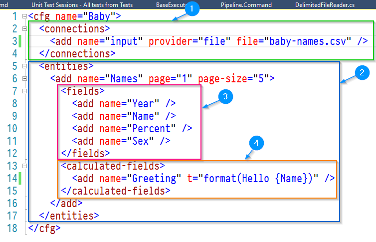

## Transformalize

This tool expedites mundane data processing tasks
like cleaning, reporting, and [denormalization](https://en.wikipedia.org/wiki/Denormalization).

It works with many data sources:

<table class="table table-condensed">
    <thead>
        <tr>
            <th>Provider</th>
            <th>Input</th>
            <th>Output</th>
        </tr>
    </thead>
    <tbody>
        <tr>
            <td>SQL Server</td>
            <td>&#10004;</td>
            <td>&#10004;</td>
        </tr>
        <tr>
            <td>MySql</td>
            <td>&#10004;</td>
            <td>&#10004;</td>
        </tr>
        <tr>
            <td>PostgreSql</td>
            <td>&#10004;</td>
            <td>&#10004;</td>
        </tr>
        <tr>
            <td>SQLite</td>
            <td>&#10004;</td>
            <td>&#10004;</td>
        </tr>
        <tr>
            <td>SqlCe</td>
            <td>&#10004;</td>
            <td>&#10004;</td>
        </tr>
        <tr>
            <td>Elasticsearch</td>
            <td>&#10003;</td>
            <td>&#10003;</td>
        </tr>
        <tr>
            <td>Files</td>
            <td>&#10003;</td>
            <td>&#10003;</td>
        </tr>
        <tr>
            <td>Web</td>
            <td>&#10003;</td>
            <td> </td>
        </tr>
        <tr>
            <td>SOLR</td>
            <td>&#10003;</td>
            <td></td>
        </tr>
        <tr>
            <td>Lucene</td>
            <td>&#10003;</td>
            <td>&#10003;</td>
        </tr>
        <tr>
            <td>Console</td>
            <td></td>
            <td>&#10003;</td>
        </tr>
    </tbody>
</table>

Jobs are arranged in [XML](https://en.wikipedia.org/wiki/XML)
or [JSON](https://en.wikipedia.org/wiki/JSON) and executed 
with a [CLI](https://en.wikipedia.org/wiki/Command-line_interface).

### Getting Started

To work with data, write a configuration (aka arrangement) 
that defines a connection and an entity.  Something like this:



This arrangement ([babies.xml](./Files/babies.xml)) contains:

1. A single input connection to a [baby-names.csv](https://github.com/hadley/data-baby-names) file.  It uses the `file` provider.
2. An entities collection with one `Names` entity.
3. The fields `Year`, `Name`, `Percent`, and `Sex`.
3. A calculated field using the `format` transform to say "Hello {Name}"

Save it and run with the command line utility; `tfl.exe`:

<pre>
<strong>tfl -a babies.xml</strong>
Year,Name,Percent,Sex,Greeting
1880,John,0.081541,boy,<strong>Hello John</strong>
1880,William,0.080511,boy,<strong>Hello William</strong>
1880,James,0.050057,boy,<strong>Hello James</strong>
1880,Charles,0.045167,boy,<strong>Hello Charles</strong>
1880,George,0.043292,boy,<strong>Hello George</strong>
</pre>

In this example, Transformalize read one page 
of baby names from *baby-names.csv* (found [here](https://github.com/hadley/data-baby-names)), 
and wrote it to the console.

---

### <a name="ftdb"></a>File to Database

```xml
<cfg name="Baby">
  <connections>
    <add name="input" provider="file" file="c:\temp\baby-names.csv" />
    <add name="output" provider="sqlite" file="c:\temp\baby-names.sqlite3" />
  </connections>
  <entities>
    <add name="Names">
      <fields>
        <add name="Year" type="short" />
        <add name="Name" />
        <add name="Percent" type="double" />
        <add name="Sex" length="4" />
      </fields>
    </add>
  </entities>
</cfg>
```

This time, the arrangement (above) has a database output.  In addition:

* The `Year` field data type is set to **short**
* The `Percent` field data type is set to **double**
* The `Sex` field length is set to **4**

Run:

<pre>
<strong>tfl -ac:\temp\babies-file-to-database.xml -minit</strong>
2016-11-23 14:51:29 | warn  | Baby | Names | Initializing
2016-11-23 14:51:29 | info  | Baby | Names | Starting
2016-11-23 14:51:30 | info  | Baby | Names | 10000
2016-11-23 14:51:32 | info  | Baby | Names | 20000
<em>... clipped for brevity, it just increments by 10k ...</em>
2016-11-23 14:52:07 | info  | Baby | Names | 258000 inserts into output
2016-11-23 14:52:07 | info  | Baby | Names | Ending 00:00:38.0280314
</pre>

In this example, Transformalize reads the rows of *baby-names.csv* 
and stores them in a database.  When persisting to a database, the 
database must be initialized.  So, the first time you run an arrangement like this, 
pass the mode (**-m**) flag in with *init*.

### <a name="dbtdb"></a>Database (or Databases) to Database: 

The data you want may be found in more than one place. 
This example demonstrates combining data. 

```xml
<cfg name="Names">

  <connections>
    <add name="baby-names" provider="sqlite" file="c:\temp\baby-names.sqlite3" />
    <add name="bible-names" provider="sqlite" file="c:\temp\bible-names.sqlite3" />
    <add name="output" provider="sqlite" file="c:\temp\names.sqlite3" />
  </connections>
	
  <entities>
    <add name="BabyNames" connection="baby-names">
      <fields>
        <add name="Year" type="short" primary-key="true" />
        <add name="Name" primary-key="true" />
        <add name="Sex" length="4" primary-key="true" />
        <add name="Percent" type="double" />
      </fields>
    </add>
    <add name="BibleNames" connection="bible-names">
      <fields>
        <add name="Name" primary-key="true"/>
      </fields>
      <calculated-fields>
        <add name="IsOldSchool" length="3" t="copy(Name).javascript(Name === '' ? 'No' : 'Yes')" default="No" />
      </calculated-fields>
    </add>
  </entities>

  <relationships>
    <add left-entity="BabyNames" left-field="Name" right-entity="BibleNames" right-field="Name" />
  </relationships>

</cfg>
```

The arrangement (above) has two entities, and their relationship to one another. 
In addition:

* The primary key for `BabyNames` is set to `Year`, `Name`, and `Sex`.
* The primary key for `BibleNames` is set to `Name`.
* An `IsOldSchool` calculated column is defined with a `javascript` transform to 
produce a *Yes* or *No*.


After this is run, the output *names.sqlite* contains the view `NamesStar`.  To view 
the data, write a query like this:

```sql
SELECT Year, Name, Sex, Percent, IsOldSchool
FROM NamesStar
LIMIT 10
```

Which produces:

<pre>
<strong>Year    Name    Sex     Percent IsOldSchool</strong>
1880	John	boy	0.081541	No
1880	William	boy	0.080511	No
1880	James	boy	0.050057	No
1880	Charles	boy	0.045167	No
1880	George	boy	0.043292	No
1880	Frank	boy	0.02738	    No
<strong>1880	Joseph	boy	0.022229	Yes</strong>
1880	Thomas	boy	0.021401	No
1880	Henry	boy	0.020641	No
1880	Robert	boy	0.020404	No
</pre>

A subsequent run of the above arrangement without the `-m init` flag updates 
the output (based on the input).  Combined with database version fields (a field 
that increments everytime the row is updated), Transformalize may be setup to read 
just the differences from the input and update the output efficiently.

### More Docs Needed...

Need Examples for:

1. Using versions to setup incremental updates.
2. Using [nssm](https://nssm.cc) to run Transformalize as a service with cron schedule.
3. From Database to Elasticsearch, for purposes of using the data in Kibana dashboard.
4. Summary of transforms, plus verbose and short-hand method of defining them. See [this](https://github.com/dalenewman/Transformalize/blob/master/Pipeline.Ioc.Autofac/TransformFactory.cs) to get an idea.
5. Using the [Orchard CMS](http://www.orchardproject.net) module for secured reporting, etc.


### Build Notes

1. Use Visual Studio 2015+.
2. Add SolrNet package source: https://ci.appveyor.com/nuget/solrnet-022x5w7kmuba
3. Copy the dlls from the *x86* or *x64* folder to where *tfl.exe* is.

**NOTE**: This is the 2nd implementation.  To find out more Transformalize,
read the [article](http://www.codeproject.com/Articles/658971/Transformalizing-NorthWind)
I posted to Code Project (based on the 1st implementation).