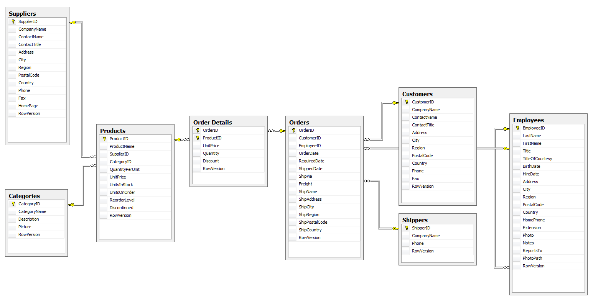
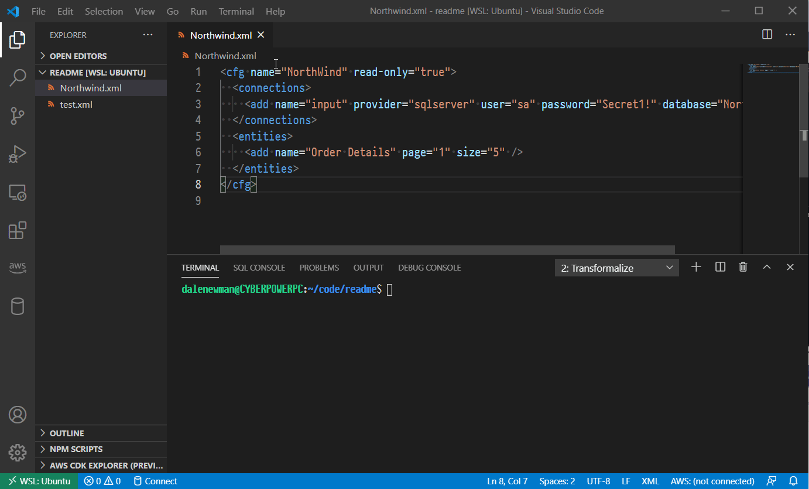
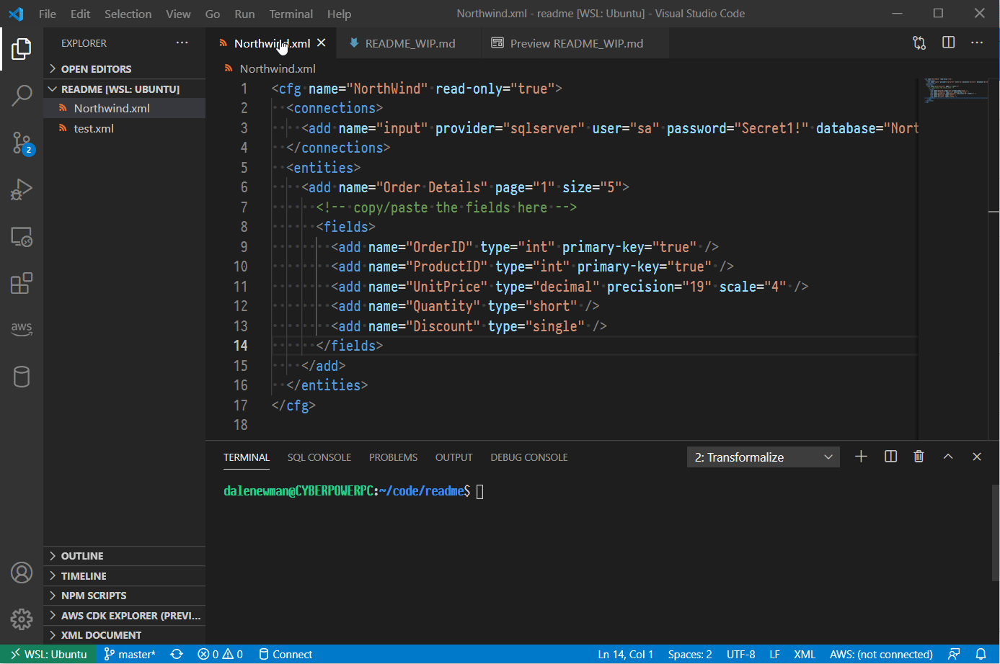
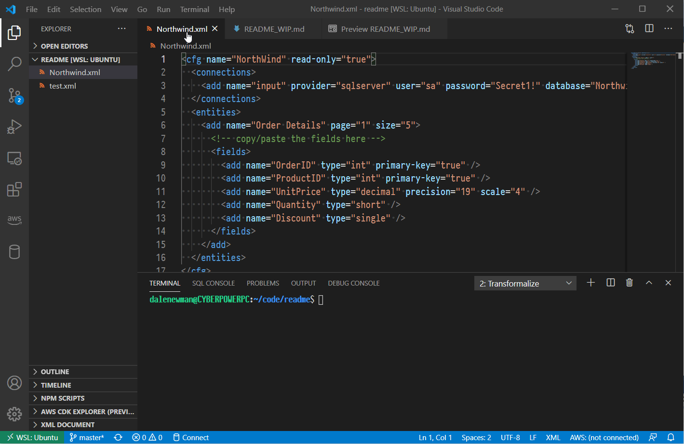
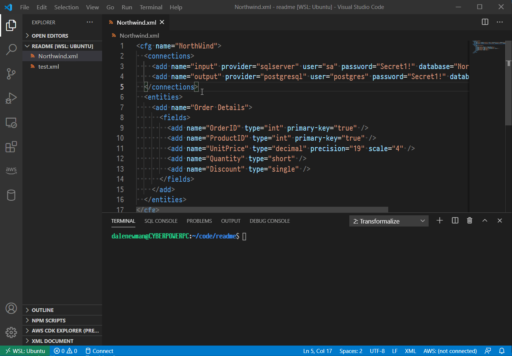
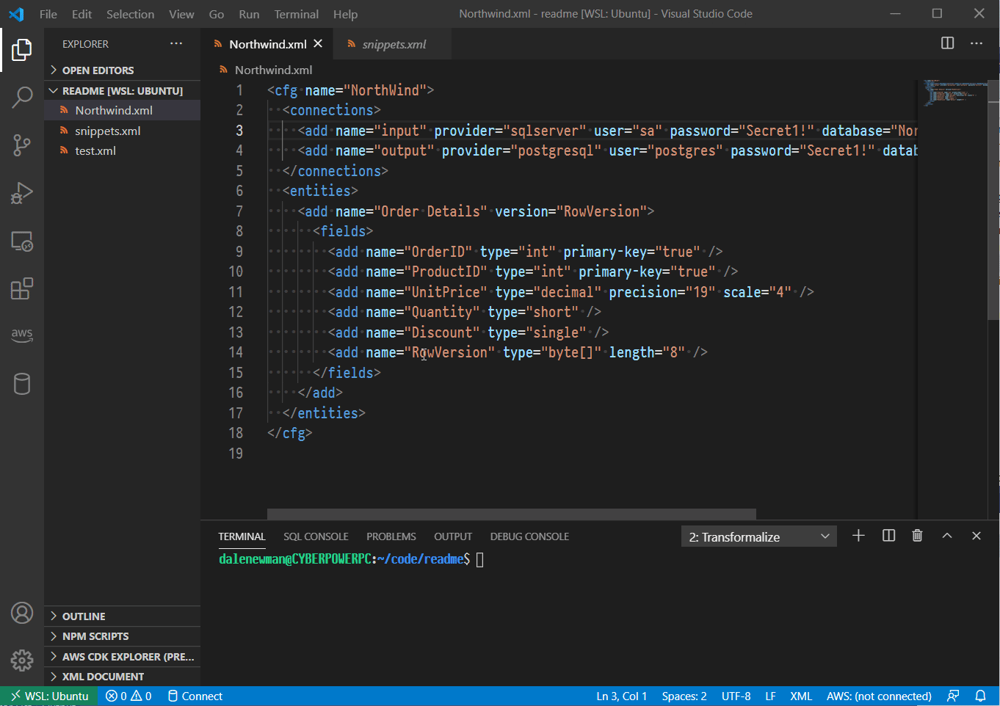
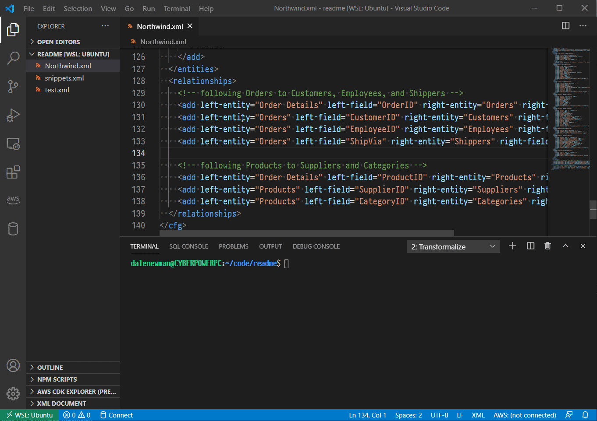
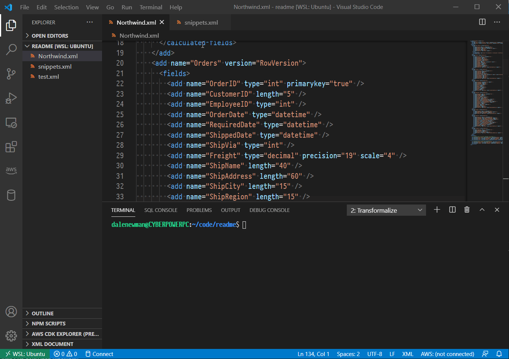

# Transformalize

Transformalize is a configuration based ETL tool that automates 
incremental denormalization of relational data.  It may be 
used for other types of [ETL](https://en.wikipedia.org/wiki/Extract,_transform,_load) 
as well.  

The supported inputs and outputs are below. 

<div class="table-responsive" style="font-size:smaller;">
<table class="table table-condensed">
    <thead>
      <!--<tr>
         <th colspan="3" style="text-align:center">Cross Platform</th>
      </tr>-->
        <tr>
            <th>Relational</th>
            <th colspan="2" style="text-align:center">Non-Relational</th>
        </tr>
    </thead>
    <tbody>
        <tr>
            <td style="vertical-align:top">
                <table class="table table-condensed">
                    <thead>
                        <tr>
                            <th>Provider</th>
                            <th>Support</th>
                        </tr>
                    </thead>
                    <tbody>
                        <tr>
                            <td><a href="https://github.com/dalenewman/Transformalize.Provider.SqlServer">SQL Server</a></td>
                            <td >In/Out</td>
                        </tr>
                        <tr>
                            <td><a href="https://github.com/dalenewman/Transformalize.Provider.MySql">MySql</a></td>
                            <td >In/Out</td>
                        </tr>
                        <tr>
                            <td><a href="https://github.com/dalenewman/Transformalize.Provider.PostgreSql">PostgreSql</a></td>
                            <td >In/Out</td>
                        </tr>
                        <tr>
                            <td><a href="https://github.com/dalenewman/Transformalize.Provider.Sqlite">SQLite</a></td>
                            <td >In/Out</td>
                        </tr>
                    </tbody>
                </table>
            </td>
            <td style="vertical-align:top">
                <table class="table table-condensed">
                    <thead>
                        <tr>
                            <th>Provider</th>
                            <th>Support</th>
                        </tr>
                    </thead>
                    <tbody>
                        <tr>
                            <td><a href="https://github.com/dalenewman/Transformalize.Provider.Elasticsearch">Elasticsearch</a></td>
                            <td>In/Out</td>
                        </tr>
                        <tr>
                            <td><a href="https://github.com/dalenewman/Transformalize.Provider.Excel">Excel</a></td>
                            <td>In</td>
                        </tr>
                        <tr>
                            <td><a href="https://github.com/dalenewman/Transformalize.Provider.CsvHelper">Files</a></td>
                            <td>In/Out</td>
                        </tr>
                        <tr>
                            <td><a href="https://github.com/dalenewman/Transformalize.Provider.Mail">Mail</a></td>
                            <td>Out</td>
                        </tr>                        
                    </tbody>
                </table>
            </td>
            <td style="vertical-align:top">
                <table class="table table-condensed">
                    <thead>
                        <tr>
                            <th>Provider</th>
                            <th>Support</th>
                        </tr>
                    </thead>
                    <tbody>
                        <tr>
                            <td>Console</td>
                            <td>In/Out</td>
                        </tr>
                        <tr>
                            <td><a href="https://github.com/dalenewman/Transformalize.Provider.Razor">Razor</a></td>
                            <td>Out</td>
                        </tr>
                        <tr>
                            <td title="Forms in Orchard CMS Module"><a href="https://github.com/dalenewman/OrchardCore.Transformalize">Forms</a></td>
                            <td>In</td>
                        </tr>
                        <tr>
                            <td><a href="https://github.com/dalenewman/Transformalize.Provider.Bogus">Bogus</a></td>
                            <td>In</td>
                        </tr>
                    </tbody>
                </table>
            </td>
        </tr>
    </tbody>
</table>
</div>

<!--<div class="table-responsive" style="font-size:smaller;">
<table class="table table-condensed">
    <thead>
      <tr>
         <th colspan="3" style="text-align:center">Windows Only<span style="font-size:smaller"></span></th>
      </tr>
      <tr>
         <th>Relational</th>
         <th colspan="2" style="text-align:center">Non-Relational</th>
      </tr>
    </thead>
    <tbody>
        <tr>
            <td style="vertical-align:top">
                <table class="table table-condensed">
                    <thead>
                        <tr>
                            <th>Provider</th>
                            <th>Support</th>
                        </tr>
                    </thead>
                    <tbody>
                        <tr>
                            <td><a href="https://github.com/dalenewman/Transformalize.Provider.SqlCe">SqlCe</a></td>
                            <td>In/Out</td>
                        </tr>
                        <tr>
                            <td><a href="https://github.com/dalenewman/Transformalize.Provider.Access">Access</a></td>
                            <td>In/Out</td>
                        </tr>
                        <tr>
                            <td> &nbsp;</td>
                            <td> &nbsp;</td>
                        </tr>
                        <tr>
                            <td> &nbsp;</td>
                            <td> &nbsp;</td>
                        </tr>
                    </tbody>
                </table>
            </td>
            <td style="vertical-align:top">
                <table class="table table-condensed">
                    <thead>
                        <tr>
                            <th>Provider</th>
                            <th>Support</th>
                        </tr>
                    </thead>
                    <tbody>
                        <tr>
                            <td><a href="https://github.com/dalenewman/Transformalize.Provider.Lucene">Lucene</a></td>
                            <td>In/Out</td>
                        </tr>
                        <tr>
                            <td><a href="https://github.com/dalenewman/Transformalize.Provider.Solr">SOLR</a></td>
                            <td>In/Out</td>
                        </tr>
                        <tr>
                            <td><a href="https://github.com/dalenewman/Transformalize.Provider.Excel">Excel</a></td>
                            <td>Out</td>
                        </tr>
                        <tr>
                            <td><a href="https://github.com/dalenewman/Transformalize.Provider.FileHelpers">Files</a></td>
                            <td>In/Out</td>
                        </tr>
                    </tbody>
                </table>
            </td>
            <td style="vertical-align:top">
                <table class="table table-condensed">
                    <thead>
                        <tr>
                            <th>Provider</th>
                            <th>Support</th>
                        </tr>
                    </thead>
                    <tbody>
                        <tr>
                            <td title="SQL Server Analysis Services"><a href="https://github.com/dalenewman/Transformalize.Provider.Ssas">SSAS</a></td>
                            <td>Out</td>
                        </tr>
                        <tr>
                            <td><a href="https://github.com/dalenewman/Transformalize.Provider.RethinkDb">RethinkDB</a></td>
                            <td>Out</td>
                        </tr>
                        <tr>
                            <td><a href="https://github.com/dalenewman/Transformalize.Provider.ActiveDirectory">Active Directory</a></td>
                            <td>In</td>
                        </tr>
                        <tr>
                            <td> &nbsp;</td>
                            <td> &nbsp;</td>
                        </tr>                        
                    </tbody>
                </table>
            </td>
        </tr>
    </tbody>
</table>
</div>-->

---

### Getting Started

This *readme* demonstrates how to denormalize a relational database and load it into Elasticsearch.
 
To follow along, see the [prerequisites](https://github.com/dalenewman/Transformalize/wiki/README-Prerequisites).

When you start denormalizing a database, it's good to have a diagram. 



This shows eight [normalized](https://en.wikipedia.org/wiki/Database_normalization) 
tables related to *Order Details*. 

> This section introduces `<connections/>`, `<entities/>`, and the `page` and `size` attributes.

Transformalize arrangements are written in [XML](https://en.wikipedia.org/wiki/XML) or [JSON](https://en.wikipedia.org/wiki/JSON). 
They are validated before execution.

To get started, open VS Code and paste this in:

```xml
<cfg name="NorthWind" read-only="true">
  <connections>
    <add name="input" provider="sqlserver" user="sa" password="Secret1!" database="Northwind" />
  </connections>
  <entities>
    <add name="Order Details" page="1" size="5" />
  </entities>
</cfg>
```

This defines an *input* as the `Order Details` table inside the Northwind database. 
Save it as *NorthWind.xml* and press CTRL-P to find and execute the `tfl:run` command. 



Transformalize returned the first page of rows from the `Order Details` table. 
To transform and save this data, the `<fields/>` must be defined.

> Introducing `<fields/>`.

To see the schema, press CTRL-P to find and execute the `tfl:schema` command:

<pre style="font-size:smaller;">
> tfl -a NorthWind.xml <strong>-m schema</strong>
...
&lt;fields&gt;
  &lt;add name="OrderID" type="int" primary-key="true" /&gt;
  &lt;add name="ProductID" type="int" primary-key="true" /&gt;
  &lt;add name="UnitPrice" type="decimal" precision="19" scale="4" /&gt;
  &lt;add name="Quantity" type="short" /&gt;
  &lt;add name="Discount" type="single" /&gt;
&lt;/fields>
...
</pre>

Copy the `<fields/>` from the output into your arrangement like this:

```xml
<cfg name="NorthWind">
  <connections>
    <add name="input" provider="sqlserver" user="sa" password="Secret1!" database="Northwind" />
  </connections>
  <entities>
    <add name="Order Details" page="1" size="5">
      <!-- copy/paste the fields here -->
      <fields>
        <add name="OrderID" type="int" primary-key="true" />
        <add name="ProductID" type="int" primary-key="true" />
        <add name="UnitPrice" type="decimal" precision="19" scale="4" />
        <add name="Quantity" type="short" />
        <add name="Discount" type="single" />
      </fields>
    </add>
  </entities>
</cfg>
```

> Introducing **`<calculated-fields/>`**, the **`t`** attribute, and the **`js`** and **`round`** transformations

Add **`<calculated-fields/>`** right after **`<fields/>`** like this:

```xml
<calculated-fields>
  <add name="Revenue" 
       type="decimal" 
       t="js(Quantity * ((1-Discount) * UnitPrice)).round(2)" />
</calculated-fields>
```
Execute `tfl:run` and it should produce this output:

<pre style="font-size:smaller;">
<strong>> tfl -a NorthWind.xml</strong>
OrderID,ProductID,UnitPrice,Quantity,Discount,<strong>Revenue</strong>
10248,11,14.0000,12,0,<strong>168</strong>
10248,42,9.8000,10,0,<strong>98</strong>
10248,72,34.8000,5,0,<strong>174</strong>
10249,14,18.6000,9,0,<strong>167.4</strong>
10249,51,42.4000,40,0,<strong>1696</strong>
...
</pre>

*Revenue* is created by the **js** (JavaScript) and **round** [transformations](./Containers/Autofac/Transformalize.Container.Autofac.Shared/TransformBuilder.cs).  You may chain transformations as long as the output of one is compatible with the input of another.



### Output

> Introducing **`init`** mode

Let's save *all* the `Order Details` into an output. To do this:

1. Remove the `read-only` attribute.
1. Remove the `page` and `size` attributes.
1. Define the output as a PostgreSql database named TflNorthwind in `<connections/>`.

```xml
<connections>
    <add name="input" provider="sqlserver" user="sa" password="Secret1!" database="Northwind" />
    <!-- define output here -->
    <add name="output" provider="postgres" user="postgres" password="Secret1!" database="TflNorthwind" />
</connections>
```

Press CTRL-P to find and run the `tfl:init` command.

<pre style="font-size:smaller;">
> tfl -a NorthWind.xml <strong>-m init</strong>
<strong style="color:#FF7F50;">warn  | NorthWind | Order Details | Initializing</strong>
info  | NorthWind | Order Details | 2155 from input
info  | NorthWind | Order Details | 2155 inserts into output
info  | NorthWind | Order Details | Ending 00:00:03.89
</pre>

### Initialization

Initialization is required initially and any time the structure of the output is changed.

It does three things:

1. destroys pre-existing output structures
2. creates output structures
3. bulk inserts data.



Note that writing *Order Details* into PostgreSQL frees up the standard output for logging.

#### Mapping

Transformalize doesn't *map* input to pre-existing output. Instead, it 
creates a control table and a consistent output structure 
for handling incremental updates.  

You decide:

* what new fields to calculate
* the order of fields
* the name of fields (using `alias`)
* the transformation and/or validation of fields
* and the output of field (using `output="true|false"`)

### Incrementals (by Default)

> Introducing the **`version`** attribute for an **`entity`**

An *initialization* is a full rebuild and may be time-consuming. So, by default, 
Transformalize performs incrementals. To determine if an update or insert 
is necessary, it compares input with output.

While keys and hashes are used, comparison is unnecessary 
when an input's provider is queryable and has a row version. 
A row version increments when the row changes.  Many tables 
have these by design, but if not, you can add them like this:

```sql
/* SQL Server and SQL CE */
ALTER TABLE [Order Details] ADD [RowVersion] ROWVERSION;

/* MySQL */
ALTER TABLE `Order Details` ADD COLUMN RowVersion TIMESTAMP DEFAULT CURRENT_TIMESTAMP ON UPDATE CURRENT_TIMESTAMP;

/* PostgreSql, use the system field xmin */
```

To demonstrate incrementals, add a row version to each of the eight tables 
in the SQL Server *Northwind* database.  I have provided a [script](./Files/Demo/add-row-versions-sql-server.sql) for 
convenience.

Once added, we have add the `RowVersion` to our arrangement like this:

```xml
<entities>
                            <!-- Mark it here -->
  <add name="Order Details" version="RowVersion" >
    <fields>
      <add name="OrderID" type="int" primary-key="true" />
      <add name="ProductID" type="int" primary-key="true" />
      <add name="Discount" type="single" />
      <add name="Quantity" type="short" />
      <add name="UnitPrice" type="decimal" precision="19" scale="4"/>

      <!-- It's a field, so define it here -->
      <add name="RowVersion" type="byte[]" length="8" />
    </fields>
  </add>
</entities>
```

Adding a field changes output structure, so re-initialize like so:

<pre style="font-size:smaller;">
<strong>tfl -a NorthWind.xml -m init</strong>
warn  | NorthWind | Order Details | Initializing
info  | NorthWind | Order Details | 2155 from input
info  | NorthWind | Order Details | 2155 inserts into output
info  | NorthWind |               | Time elapsed: 00:00:03.09

<strong>tfl -a NorthWind.xml</strong>
<strong>info  | NorthWind | Order Details | Change Detected: No.</strong>
info  | NorthWind |               | Time elapsed: 00:00:00.71
</pre>

With a `version` in place, the second run doesn't read and compare un-changed data.



### Denormalization

Relational data is [normalized](https://en.wikipedia.org/wiki/Database_normalization) and 
stored in many tables. It's optimized for efficient storage and integrity. It may be 
queried, but not without an overhead of joining busy tables. This makes retrieval slower.

[De-normalization](https://en.wikipedia.org/wiki/Denormalization) is the process of 
joining related data back together. The data is pre-joined (and duplicated) to 
avoid joining tables at run-time. Retrieval of de-normalized data is faster.

The output of *Order Details* (above) is numeric. Some numbers 
are [foreign keys](https://en.wikipedia.org/wiki/Foreign_key) (e.g. `ProductID`, `OrderID`). 
These refer to more descriptive information in related entities. Others are 
[measures](https://en.wikipedia.org/wiki/Measure_(data_warehouse)) (i.e. `Quantity`, `UnitPrice`).

To denormalize *Order Details*, we need to use the foreign keys `OrderID` and `ProductID` to 
retrieve the related information from *Orders* and *Products* (see diagram).  This means we have 
to add the *Orders* and *Products* entities to our arrangement.

### Adding an Entity

It's time to add another entity to our arrangement.  Here is what the `Orders` entity should look like:

```xml
<add name="Orders" version="RowVersion">
  <fields>
    <add name="OrderID" type="int" primary-key="true" />
    <add name="CustomerID" length="5" />
    <add name="EmployeeID" type="int" />
    <add name="OrderDate" type="datetime" />
    <add name="RequiredDate" type="datetime" />
    <add name="ShippedDate" type="datetime" />
    <add name="ShipVia" type="int" />
    <add name="Freight" type="decimal" precision="19" scale="4" />
    <add name="ShipName" length="40" />
    <add name="ShipAddress" length="60" />
    <add name="ShipCity" length="15" />
    <add name="ShipRegion" length="15" />
    <add name="ShipPostalCode" length="10" />
    <add name="ShipCountry" length="15" />
    <!-- note: RowVersion must be aliased to co-exist with Order Details RowVersion -->
    <add name="RowVersion" alias="OrdersRowVersion" type="byte[]" length="8" />
  </fields>
</add>
```
Because we're denormalizing entities, the field names in the output must ultimately be unique.  Since *RowVersion* is already used in *Order Details*, I need to `alias` it in *Orders*.

Moreover, if I add another entity to my arrangement, I must relate it to the first entity.

#### Relationships

> Introducing the **`<relationships/>`** section

All entities must be related to the first entity in the `<relationships/>` section which 
follows `<entities/>`.  To relate *Orders* to *Order Details*, add this to your arrangement:

```xml
<relationships>
    <add left-entity="Order Details" left-field="OrderID" right-entity="Orders" right-field="OrderID" />
</relationships>
```

This tells Transformalize to use `OrderID` to relate the two entities. Now re-initialize 
and run Transformalize:

<pre style="font-size:smaller;">
<strong>tfl -a NorthWind.xml -m init</strong>
warn  | NorthWind | Order Details | Initializing
warn  | NorthWind | Orders        | Initializing
info  | NorthWind | Order Details | 2155 from input
info  | NorthWind | Order Details | 2155 inserts into output
<strong>info  | NorthWind | Orders        | 830 from input
info  | NorthWind | Orders        | 830 inserts into output</strong>
info  | NorthWind |               | Time elapsed: 00:00:01.02

<strong>tfl -a NorthWind.xml</strong>
info  | NorthWind | Order Details | Change Detected: No.
<strong>info  | NorthWind | Orders        | Change Detected: No.</strong>
info  | NorthWind |               | Time elapsed: 00:00:00.25
</pre>



Logging indicates records were processed from *Order Details* and *Orders*. In addition, 
a view called `NorthWindStar` is created in the output.  *NorthWindStar* joins Transformalize's 
[star-schema](https://en.wikipedia.org/wiki/Star_schema) output so that it appears to be a 
single entity.

Query *NorthWindStar* to make sure Transformalize is working:

```sql
SELECT
    ProductID,
    Discount,
    Quantity,
    UnitPrice,
    CustomerID,
    EmployeeID,
    Freight,
    OrderDate,
    RequiredDate,
    ShipAddress,
    ShipCity,
    ShippedDate,
    ShipPostalCode,
    ShipRegion,
    ShipVia
FROM NorthWindStar
LIMIT 10;
```

<pre style="font-size:smaller;">
<strong>ProductId   Discount    Quantity    UnitPrice   CustomerID  EmployeeID  Freight OrderDate   RequiredDate    ShipAddress ...</strong>
<strong>---------   --------    --------    ---------   ----------  ----------  ------- ---------   ------------    -----------</strong>
11	    0.0	        12	    14	        VINET       5           32.38   1996-07-04  1996-08-01      59 rue de l'Abbaye
42	    0.0	        10	    9.8	        VINET       5           32.38   1996-07-04  1996-08-01      59 rue de l'Abbaye
72	    0.0	        5	    34.8        VINET       5           32.38   1996-07-04  1996-08-01      59 rue de l'Abbaye
14	    0.0	        9	    18.6        TOMSP       6           11.61	1996-07-05  1996-08-16      Luisenstr. 48
51	    0.0	        40	    42.4        TOMSP       6           11.61	1996-07-05  1996-08-16      Luisenstr. 48
41	    0.0	        10	    7.7         HANAR       4           65.83	1996-07-08  1996-08-05      Rua do Paço, 67
51	    0.15        35	    42.4        HANAR       4           65.83	1996-07-08  1996-08-05      Rua do Paço, 67
65	    0.15        15	    16.8        HANAR       4           65.83	1996-07-08  1996-08-05      Rua do Paço, 67
22	    0.05        6	    16.8        VICTE       3           41.34	1996-07-08  1996-08-05      2, rue du Commerce
57	    0.05        15	    15.6        VICTE       3           41.34	1996-07-08  1996-08-05      2, rue du Commerce
</pre>

### Star Schema & Single "Flat" Entity

> Introducing the **`flatten`** attribute

Transformalize de-normalizes in two phases.  First, it moves data 
from a relational model into a [star-schema](https://en.wikipedia.org/wiki/Star_schema).
Secondly, it moves data into a completely de-normalized (flat) output. 


To create a star-schema, it moves the foreign keys to the center.  Data retrieval is 
faster because everything is directly related.

To create a flat output, it moves *everything* to the center.  Data retrieval is 
even faster because there aren't any relations.

To completely de-normalize, set `flatten` to `true` 
in the main `<cfg/>` like this:

```xml
<cfg name="NorthWind" flatten="true">
    <!-- commented out for brevity -->
</cfg>
```

When you re-initialize, a single output structure named *NorthWindFlat* is created and populated. 
You may query it just as you queried *NorthWindStar*.

### More Relationships

To add all the entities from NorthWind database (diagrammed above), follow the *Add an Entity* 
process (above) for *Products*, *Customers*, *Employees*, *Shippers*, *Suppliers*, and *Categories*.

In the end, the relationships should look like this:

```xml
<relationships>
  <!-- following Orders to Customers, Employees, and Shippers -->
  <add left-entity="Order Details" left-field="OrderID" right-entity="Orders" right-field="OrderID" />
  <add left-entity="Orders" left-field="CustomerID" right-entity="Customers" right-field="CustomerID" />
  <add left-entity="Orders" left-field="EmployeeID" right-entity="Employees" right-field="EmployeeID" />
  <add left-entity="Orders" left-field="ShipVia" right-entity="Shippers" right-field="ShipperID" />

  <!-- following Products to Suppliers and Categories -->
  <add left-entity="Order Details" left-field="ProductID" right-entity="Products" right-field="ProductID" />
  <add left-entity="Products" left-field="SupplierID" right-entity="Suppliers" right-field="SupplierID" />
  <add left-entity="Products" left-field="CategoryID" right-entity="Categories" right-field="CategoryID" />
</relationships>
```

If you'd rather not do all that work, you can use this pre-created [arrangement](./Files/NorthWindEntitiesRelated-cp.xml).

Now when you initialize and run Transformalize, there's a lot going on:

<pre style="font-size:smaller;">
<strong>>tfl -a "NorthWind.xml" -m init</strong>
<span style="color:#FF7F50;">warn  | NorthWind | Order Details | Initializing
warn  | NorthWind | Orders        | Initializing
warn  | NorthWind | Products      | Initializing
warn  | NorthWind | Customers     | Initializing
warn  | NorthWind | Employees     | Initializing
warn  | NorthWind | Shippers      | Initializing
warn  | NorthWind | Suppliers     | Initializing
warn  | NorthWind | Categories    | Initializing</span>
info  | NorthWind | Order Details | 2155 from input
info  | NorthWind | Order Details | 2155 inserts into output
info  | NorthWind | Orders        | 830 from input
info  | NorthWind | Orders        | 830 inserts into output
info  | NorthWind | Products      | 77 from input
info  | NorthWind | Products      | 77 inserts into output
info  | NorthWind | Customers     | 91 from input
info  | NorthWind | Customers     | 91 inserts into output
info  | NorthWind | Employees     | 9 from input
info  | NorthWind | Employees     | 9 inserts into output
info  | NorthWind | Shippers      | 3 from input
info  | NorthWind | Shippers      | 3 inserts into output
info  | NorthWind | Suppliers     | 29 from input
info  | NorthWind | Suppliers     | 29 inserts into output
info  | NorthWind | Categories    | 8 from input
info  | NorthWind | Categories    | 8 inserts into output
info  | NorthWind |               | 2155 records inserted into flat
info  | NorthWind |               | Time elapsed: 00:00:06.58

<strong>>tfl -a "NorthWind.xml"</strong>
info  | NorthWind | Order Details | Change Detected: No.
info  | NorthWind | Orders        | Change Detected: No.
info  | NorthWind | Products      | Change Detected: No.
info  | NorthWind | Customers     | Change Detected: No.
info  | NorthWind | Employees     | Change Detected: No.
info  | NorthWind | Shippers      | Change Detected: No.
info  | NorthWind | Suppliers     | Change Detected: No.
info  | NorthWind | Categories    | Change Detected: No.
info  | NorthWind |               | Time elapsed: 00:00:01.40
</pre>


### Incrementals (Part 2)

Let's simulate a data change.

```sql
UPDATE Customers
SET CompanyName = 'Bottom Dollar Markets'
WHERE CustomerID = 'BOTTM';
```
Now run Transformalize again:

<pre style="font-size:smaller;">
<strong>>tfl -a "NorthWind.xml"</strong>
info  | NorthWind | Order Details | Change Detected: No.
info  | NorthWind | Orders        | Change Detected: No.
info  | NorthWind | Products      | Change Detected: No.
info  | NorthWind | Customers     | Change Detected: Input: 0x75ad2 > Output: 0x73bb5
<strong>info  | NorthWind | Customers     | 1 from input
info  | NorthWind | Customers     | 1 to output
info  | NorthWind | Customers     | 1 updates to output</strong>
info  | NorthWind | Employees     | Change Detected: No.
info  | NorthWind | Shippers      | Change Detected: No.
info  | NorthWind | Suppliers     | Change Detected: No.
info  | NorthWind | Categories    | Change Detected: No.
<strong>info  | NorthWind |               | 35 records updated in flat</strong>
info  | NorthWind |               | Time elapsed: 00:00:01.79
</pre>

Using the version, Transformalize picked up the one change in *Customers*.  Since this 
customer has purchased 35 items (in *Order Details*), the flat table is updated as well.



### Transformations to Make Life Easier

> * Introducing the **`copy`** transform
> * the **`datePart`** transform
> * the **`format`** transform
> * the **`toUpper`** transform

Most often, in addition to de-normalization, you'll need to transform records too. 
Transformalize de-normalizes and transforms at the same time (thus, the name).

Let's add some time [dimension](https://en.wikipedia.org/wiki/Dimension_(data_warehouse)) fields. 
Modify the *Orders* entity to include a `<calculated-fields/>` section like this:

```xml
<calculated-fields>
  <add name="OrderYear" type="int" t="copy(OrderDate).datePart(year)" />
  <add name="OrderMonthSortable" t="format({OrderDate:MM-MMM}).toUpper()" />
  <add name="OrderDaySortable" t="format({OrderDate:yyyy-MM-dd})" />
  <add name="OrderDayOfWeek" t="copy(OrderDate).datePart(dayOfWeek)" />
</calculated-fields>		
```

**Note**: The **`copy`** method is mainly used to copy 
other fields into your transformation.  Generally speaking, when a 
transform uses field names in it's expression (e.g. **`js`**, **`cs`**, and **`format`**), 
you don't need to preceed it with a **`copy`** method.

After re-initializing, *NorthWindFlat* has some helpful time related fields that allow you 
to run queries like:

```sql
SELECT OrderDayOfWeek AS "Day", SUM(Revenue) AS "Sales"
FROM NorthWindFlat
GROUP BY OrderDayOfWeek
```
<pre style="font-size:smaller;">
<strong>Day         Sales</strong>
Friday      284393.64
Monday      275256.90
Thursday    256143.26
Tuesday     272113.27
Wednesday   266546.72
</pre>

Note that the query isn't dealing with joins or parsing dates. This is 
because we de-normalized it and pre-calculated useful fields.



## Post De-Normalization

> * Introducing system fields in output
> * the **`read-only`** attribute

Transformalize must use a relational output to de-normalize (i.e. PostgreSQL).  However, now that it's flat, we can leverage the non-relational providers as well.

Transformalize records four *system* fields that may 
be used by additional `tfl` arrangements and/or other systems:

* TflKey - a surrogate key (an auto-incrementing value)
* TflBatchId - a version number corresponding to `tfl` runs
* TflHashCode - a numerical value calculated from every field (used for comparisons)
* TflDeleted - a boolean field tracking deletes (an optional setting)

**Note:** You can disable system fields by setting `read-only` 
to `true` in the top-most `<cfg/>` element.

### Leveraging Elasticsearch & Kibana

> Introducing the **elasticsearch** provider

This section demonstrates how to load the flattened Northwind 
data into [Elasticsearch](https://www.elastic.co/products/elasticsearch) 
and view it with [Kibana](https://www.elastic.co/products/kibana).

#### Elasticsearch

Start a new arrangement with this in your XML editor:

```xml
<cfg name="NorthWind">
  <connections>
    <add name="input" provider="postgresql" user="postgres" password="Secret1!" database="TflNorthwind" />
    <add name="output" 
         provider="elasticsearch" 
         server="localhost" 
         port="9200" 
         index="northwind" 
         version="7.9.3" />
  </connections>
  <entities>
    <add name="NorthWindFlat" version="TflBatchId" >
      <fields>
        <add name="TflKey" alias="Key" type="int" primary-key="true" />
        <add name="TflBatchId" alias="Version" type="int" />
        <add name="Revenue" type="decimal" precision="19" scale="2" />
        <add name="Freight" type="decimal" precision="19" scale="4" />
        <add name="OrderDate" type="datetime" />
        <add name="OrderYear" type="int" />
        <add name="OrderMonthSortable" />
        <add name="Country" length="15" />
        <add name="CategoryName" length="15" />
      </fields>
    </add>
  </entities>
</cfg>
```

This arrangement uses an elasticsearch output.  Save as *NorthWindToES.xml* and run in it:

<pre style="font-size:smaller;">
<strong>>tfl -a c:\temp\NorthWindToES.xml -m init</strong>
warn  | NorthWind | NorthWindFlat | Initializing
info  | NorthWind | NorthWindFlat | 2155 from input
info  | NorthWind | NorthWindFlat | 2155 to output
info  | NorthWind |               | Time elapsed: 00:00:02.40

<strong>>tfl -a c:\temp\NorthWindToES.xml</strong>
info  | NorthWind | NorthWindFlat | Starting
info  | NorthWind | NorthWindFlat | Change Detected: No.
info  | NorthWind |               | Time elapsed: 00:00:00.30
</pre>

A quick query in your browser can confirm records loaded:

[http://localhost:9200/northwind/northwindflat/_search?q=*:*&size=0](http://localhost:9200/northwind/northwindflat/_search?q=*:*&size=0)

```json
{
    "took": 2,
    "timed_out": false,
    "_shards": {
        "total": 5,
        "successful": 5,
        "failed": 0
    },
    "hits": {
        "total": 2155,
        "max_score": 0.0,
        "hits": []
    }
}
```


### Leveraging the Orchard Core CMS Module

The [OrchardCore.Transformalize](https://github.com/dalenewman/OrchardCore.Transformalize) module allows you to:

* edit, store, and secure your arrangements
* run your arrangements as tasks (like the CLI does)
* view and page through your arrangements as reports
* export search results
* compose bulk actions; select records from your report and run tasks on them.

Here's a quick video of a Northwind report using the Elasticsearch provider we loaded earlier:


The arrangement for this is:

```xml
<cfg name="NorthWind">
  <connections>
    <add name="input" 
         provider="elasticsearch" 
         server="host.docker.internal" 
         index="northwind" 
         version="7.9.3" />
  </connections>
  <entities>
    <add name="northwindflat" alias="NorthWind" page="1" size="10" sortable="true" >
      <fields>
        <add name="tflkey" alias="Key" type="long" primary-key="true" output="false" />
        <add name="orderyear" type="long" label="Year" parameter="facet" />
        <add name="ordermonthsortable" label="Month" parameter="facet" />
        <add name="orderdate" type="datetime" label="Date" format="yyyy-MM-dd" />
        <add name="country" label="Country" length="15" />
        <add name="categoryname" length="15" label="Category" parameter="facet" />
        <add name="freight" label="Freight" type="decimal" precision="19" scale="4" format="$#,###,###.00" />
        <add name="revenue" label="Revenue" type="decimal" precision="19" scale="2" format="$#,###,###.00" />
      </fields>
    </add>
  </entities>
</cfg>
```

> * Introducing the `parameter` attribute in fields.

The report arrangement above is using the field's `parameter` attribute.  This is only for 
the Orchard Core module.  It is a short-cut that sets up parameters and filters.  It has three settings:

- *facet* : a drop-down for selecting a single value 
- *facets* : a drop-down for selecting multiple values
- *search* : a text box for searching

The OrchardCore module has many specific "web" features.  More information can be found [here](https://github.com/dalenewman/OrchardCore.Transformalize).

## To Be Continued

This is the end for now.  This article provides a brief overview of how you'd denormalize a relational database and make use of the flattened output in various ways. I will try to get more documentation created as time permits.

**Note**: This readme is for the updated cross-platform version of Transformalize, the old version is [here](README_LEGACY.md).