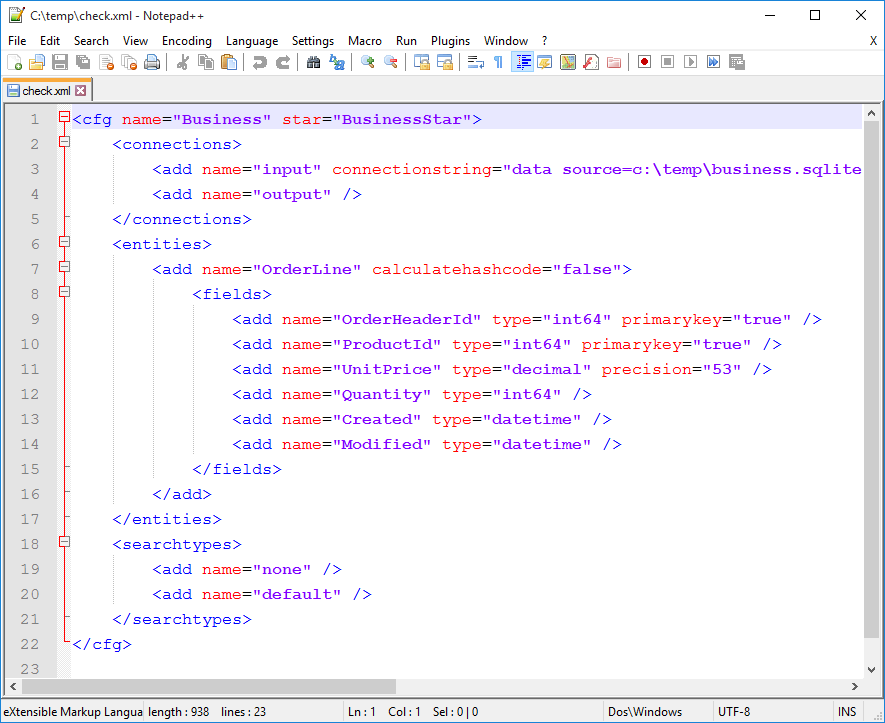

# Transformalize
Transformalize is released under the Apache 2 license.

**Caution**: It is still under development.  Breaking changes are guarenteed.


## What is it?
Transformalize is a configurable [ETL](https://en.wikipedia.org/wiki/Extract,_transform,_load) solution specializing in incremental 
[denormalization](https://en.wikipedia.org/wiki/Denormalization). It is used to prepare data for [data warehouses](https://en.wikipedia.org/wiki/Data_warehouse), 
[search engines](https://en.wikipedia.org/wiki/Search_engine_(computing)), and other 
forms of analysis and/or presentation. Transformalize may also be referred to as *TFL*.


### <a name="CFG"></a>Configurable
TFL processes are designed in an [XML](https://en.wikipedia.org/wiki/XML) or 
[JSON](https://en.wikipedia.org/wiki/JSON) editor. Designing a process is writing a 
configuration. A TFL process *configuration* may also be referred to as an *arrangement*.

TFL is configurable in order to embrace change.  To incorpate a change request:

1. Disable incremental processing
1. Edit your XML or JSON arrangement.
1. Execute TFL in `init` mode (to rebuild it)
1. Enable incremental processing

A TFL output is disposable.  You may routinely create and destroy it.

### <a name="ETL"></a>ETL
At it's heart, TFL is an [ETL](https://en.wikipedia.org/wiki/Extract,_transform,_load) 
(**E**xtract, **T**ransform, and **L**oad) solution. However, it doesn't cover all forms of ETL. 
Instead, it specializes in transforming relational models 
into [star-schemas](https://en.wikipedia.org/wiki/Star_schema).  While the input varies, the 
output is predetermined.

### <a name="DEN"></a>De-normalization
[Normalization](https://en.wikipedia.org/wiki/Database_normalization) of data is 
performed to maintain data integrity and minimize data redundancy. Data is separated into meaningful 
entities and related with keys.  Integrity is enforced by constraints and relationships. While 
this is optimal for storage, it introduces some complexity and performance issues for retrieval.

[De-normalization](https://en.wikipedia.org/wiki/Denormalization) reverses normalization 
in order to reduce complexity and improve performance of retrieval.

Ideally, we want the benefits of normalized and de-normalized data. So, we store 
data in a normalized [RDBMS](https://en.wikipedia.org/wiki/Relational_database_management_system), 
and we de-normalize it for our [data warehouses](https://en.wikipedia.org/wiki/Data_warehouse), 
[search engines](https://en.wikipedia.org/wiki/Search_engine_(computing)), and other needs.

Using relational input and output, a TFL process re-arranges related entities 
into a star-schema and provides a de-normalized (flat) view of the data.


In the graphic above, TFL transforms the relational model (on the left), to the star-schema (on the right). 
It is easier for other value-adding data services to take advantage of the star-schema.  The data in 
the star-schema is kept updated by TFL's ability to process incrementals.

### Incrementals
Initially, TFL processes all of your data per the arrangement. Subsequent 
processing targets new, updated, and deleted data. If you do not physically 
delete rows, but instead mark rows as *deleted*, then you may omit checking 
for deletes. Setup with *version* fields (a field that increments it's value on update), 
incrementals are fast and efficient.

TFL may be setup as a service with [nssm](https://nssm.cc) and run 
incrementals based on cron expressions (enabled by [Quartz.net](http://www.quartz-scheduler.net/)).

---

<!--
Currently implemented SQL-based providers are:

* SQL Server
* Postgres
* MySQL
* SQLite

Additional providers do not support de-normalization, but may be used 
to push denormalized data elsewhere. They are:

* ElasticSearch
* SOLR
* Lucene
* Files
* Memory (for other forms of presentation)

-->

### Getting Started

The best way you can understand how to use TFL is by reviewing samples.

#### Sample Data
I used [SQLite Browser](http://sqlitebrowser.org/) to create the database: [business.sqlite3](Files/business.sqlite3) with 
this [script](Files/business.sql). There are five small entities: `Company`, `Product`, `Customer`, `OrderHeader`, and `OrderLine`. 
To retrieve all relevent data from it, one writes a query like this:

```sql
SELECT
	ol.OrderHeaderId,
	ol.ProductId,
	ol.UnitPrice,
	ol.Quantity,
	oh.CustomerId,
	oh.Created AS OrderDate,
	cu.Prefix AS CustomerPrefix,
	cu.FirstName AS CustomerFirstName,
	cu.MiddleName AS CustomerMiddleName,
	cu.LastName AS CustomerLastName,
	cu.Suffix AS CustomerSuffix,
	p.Name AS ProductName,
	p.UnitPrice AS ProductUnitPrice,
	p.CompanyId,
	co.Name as CompanyName
FROM OrderLine ol
INNER JOIN OrderHeader oh ON (oh.Id = ol.OrderHeaderId)
INNER JOIN Customer cu ON (cu.Id = oh.CustomerId)
INNER JOIN Product p ON (p.Id = ol.ProductId)
INNER JOIN Company co ON (co.Id = p.CompanyId);
```

As you can see by the query above, with just five entities, there is some 
complexity in retrieving the data.  Moreover, as the model and data grow, the query's complexity 
increases, and retrieval performance decreases.

#### A Single Entity: OrderLine

Let's start with `OrderLine` since it is the most important fact in our model, and it is related 
to everything.  Create the file *c:\temp\Business.Xml* and copy/paste the XML below into it:

```xml
<cfg name="Business">
    <connections>
        <add name="input" provider="sqlite" file="c:\temp\business.sqlite3" />
    </connections>
    <entities>
        <add name="OrderLine" />
    </entities>
</cfg>
```

Run `tfl.exe -ac:\temp\Business.xml`.  This should produce the warning:

> The entity OrderLine doesn't have any input fields defined.

Your *c:\temp\Business.xml* is checked everytime you try and 
run it.  Any errors found will stop it from running.  The above 
was a warning.  It was followed by the line:

> Detected 6 fields in OrderLine.

So, Transformalize saw that we hadn't defined any fields, or 
an output, and it detected the fields and output to the console:

```bash
OrderHeaderId,ProductId,UnitPrice,Quantity,Created,Modified
1,1,3000,1,6/3/2016 1:49:11 PM,6/3/2016 1:49:11 PM
1,6,1.19,6,6/3/2016 1:49:11 PM,6/3/2016 1:49:11 PM
2,2,1499,1,6/3/2016 1:49:11 PM,6/3/2016 1:49:11 PM
2,6,1.09,12,6/3/2016 1:49:11 PM,6/3/2016 1:49:11 PM
3,3,15,2,6/3/2016 1:49:11 PM,6/3/2016 1:49:11 PM
3,6,1.29,4,6/3/2016 1:49:11 PM,6/3/2016 1:49:11 PM
4,6,1.19,6,6/3/2016 1:49:11 PM,6/3/2016 1:49:11 PM
5,4,499,1,6/3/2016 1:49:11 PM,6/3/2016 1:49:11 PM
5,9,26.95,1,6/3/2016 1:49:11 PM,6/3/2016 1:49:11 PM
5,10,19.99,1,6/3/2016 1:49:11 PM,6/3/2016 1:49:11 PM
5,8,1.19,3,6/3/2016 1:49:11 PM,6/3/2016 1:49:11 PM
6,4,399,1,6/3/2016 1:49:11 PM,6/3/2016 1:49:11 PM
6,5,699,1,6/3/2016 1:49:11 PM,6/3/2016 1:49:11 PM
6,7,3.19,1,6/3/2016 1:49:11 PM,6/3/2016 1:49:11 PM
```

By default, the output is `csv`, but you can change it to `json` 
with the -o flag if you want.

Transformalize is **e**xtracting `OrderLine` from the 
SQLite database and **l**oading it to the console.  So, this is 
still ETL; just minus the **T** at this point.

It's nice that it detected fields, but I need them recorded 
in the arrangement file *Business.xml*. So, I run `tfl` in `check` mode, pipe the output to *c:\temp\check.xml*, 
and open *c:\temp\check.xml* in whatever Windows associates XML file
with:

`tfl -ac:\temp\Business.xml -lnone -mcheck > c:\temp\check.xml && start c:\temp\check.xml`



---

TBC (To be Continued)...

---

**NOTE**: This code-base is the 2nd implementation.  To find out more about 
how Transformalize works, you can read the [article](http://www.codeproject.com/Articles/658971/Transformalizing-NorthWind) 
on Code Project (based on the 1st implementation).

 


