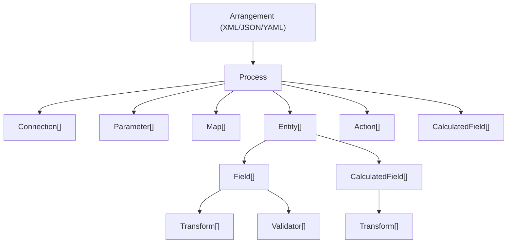

# Architecture

This document describes the high-level architecture of Transformalize.

## Overview

Transformalize processes data through a pipeline that reads from input connections, applies transforms, and writes to a connection based on the provider's implementation. The pipeline is driven entirely by a configuration file (an *arrangement*) written in XML, JSON, or YAML.



## Core Concepts

### Process

A `Process` is the top-level unit of work. It holds:

- **Connections** — named references to data sources and destinations (databases, files, APIs, etc.)
- **Entities** — the data sets to extract, transform, and load
- **Maps** — lookup tables used by the `map` transform
- **Actions** — pre- and post-process actions (e.g., run a SQL command, copy a file)
- **Parameters** — runtime values that can be injected into arrangements
- **Calculated Fields** — derived columns produced by fields and transforms in multiple entities

### Entity

An `Entity` represents a single data set (typically a database table or a file). Each entity defines:

- **Fields** — the columns to read from the input
- **Calculated Fields** — derived columns produced by transforms
- **Version** — an optional field used for incremental change detection

### Fields and Transforms

Fields describe the shape of the data. Each field has a name, type, and optional transforms.

Transforms are applied to fields using the `t` shorthand attribute:

```xml
<add name="Name" t="trim().toupper()" />
```

Multiple transforms are chained left to right with the dot (`.`) separator. Each transform receives the output of the previous one.

### Pipeline Composition

For each entity, Transformalize assembles a pipeline:

1. **Read** — extract rows from the input provider
2. **Transform** — apply field-level and entity-level transforms to each row
3. **Write** — load rows into the output provider

In incremental mode, the pipeline includes additional steps:

1. Read input keys and version values
2. Compare against output keys and version values
3. Classify rows as inserts or updates
4. Read full rows for changed records only
5. Transform
6. Write inserts and updates to the output

## Provider Model

Providers are the adapters that connect Transformalize to external systems. Providers determine how the output is written.

### IInputProvider

Defined in `Transformalize.Contracts.IInputProvider`, an input provider implements:

- `Read()` — returns an enumerable of rows from the source
- `GetFields()` — returns schema information for the entity

Implementations exist for SQL Server, PostgreSQL, MySQL, SQLite, Elasticsearch, CSV files, Excel, Bogus (test data), and more.

### IOutputProvider

Defined in `Transformalize.Contracts.IOutputProvider`, an output provider implements:

- `Write(IEnumerable<IRow> rows)` — writes rows to the destination
- `Initialize()` — creates or prepares the output structure (e.g., create tables)
- `Delete()` — handles row deletions when applicable

Implementations exist for SQL Server, PostgreSQL, MySQL, SQLite, Elasticsearch, CSV, JSON, GeoJSON, Razor templates, and more.

### IOutputController

The `IOutputController` coordinates the output lifecycle:

- Initialization (creating output tables/indexes)
- Version tracking for incremental loads
- Row counting for logging and progress reporting

## Transform Model

All built-in transforms extend `Transformalize.Transforms.BaseTransform`, which implements `ITransform`.

A transform must implement:

```csharp
public abstract IRow Operate(IRow row);
```

This method receives a row, modifies one or more field values, and returns the row.

Transforms register themselves with one or more method names via `GetSignatures()`. These method names correspond to what users write in the `t` attribute. For example, `TrimTransform` registers the method name `trim`, so users write `t="trim()"`.

Transforms can also:

- Accept parameters (e.g., `left(5)` takes a `length`)
- Produce new fields (e.g., `fromsplit` splits a field into multiple output fields)
- Produce new rows (e.g., `torow` expands an array into multiple rows)
- Filter rows (e.g., `include` and `exclude`)

## Configuration Model (Cfg-NET)

Transformalize uses [Cfg-NET](https://github.com/dalenewman/Cfg-Net) for configuration parsing and validation. Cfg-NET reads XML, JSON, or YAML into strongly-typed C# configuration classes.

The main configuration classes live in `Transformalize.Configuration`:

- `Process` — the root configuration object
- `Connection` — a data source or destination
- `Entity` — a data set definition
- `Field` — a column definition
- `Operation` — a transform or validator definition

Cfg-NET provides:

- Attribute-based validation
- Default values
- Shorthand expansion (the `t` and `v` attribute syntax)
- Parameter place-holder support

## Dependency Injection (Autofac)

The CLI and hosting applications use [Autofac](https://autofac.org/) to compose the pipeline at runtime. The DI container is configured using modules:

- **TransformModule** — registers all built-in transforms
- **Provider-specific modules** (e.g., `SqlServerModule`, `ElasticsearchModule`) — register readers, writers, and initializers for each provider

The `TransformBuilder` class in `Transformalize.Containers.Autofac` handles transform registration. Each transform is registered by its method name(s), so when the pipeline encounters a `t="trim()"` attribute, it resolves the `TrimTransform` from the container.

Provider modules follow the same pattern: they register implementations of `IInputProvider`, `IOutputProvider`, `IOutputController`, and related interfaces keyed by connection type.

### Adding a Provider

To add a new provider:

1. Implement the required interfaces (`IInputProvider`, `IOutputProvider`, etc.)
2. Create an Autofac module that registers your implementations
3. Reference the module from the CLI project or your host application

This design keeps the core library free of provider-specific dependencies. The core library (`Transformalize`) targets .NET Standard 2.0 and has no dependency on Autofac or any specific provider.

## Project Structure

```
src/
  Transformalize/           Core library (netstandard2.0)
    Configuration/          Cfg-NET configuration classes
    Contracts/              Interfaces (IInputProvider, ITransform, etc.)
    Transforms/             Built-in transforms
  CLI/                      Command-line tool (net10.0)
  Containers/Autofac/       DI registration and pipeline composition
  Providers/                Provider implementations
    SqlServer/
    PostgreSql/
    MySql/
    Sqlite/
    Elasticsearch/
    CsvHelper/
    Json/
    GeoJson/
    Bogus/
    ...
  Transforms/               Additional transform packages
    Fluid/                  Liquid templates
    Jint/                   JavaScript
    Humanizer/              Humanize/dehumanize
    LambdaParser/           Expression evaluation
    Razor/                  Razor templates
```
